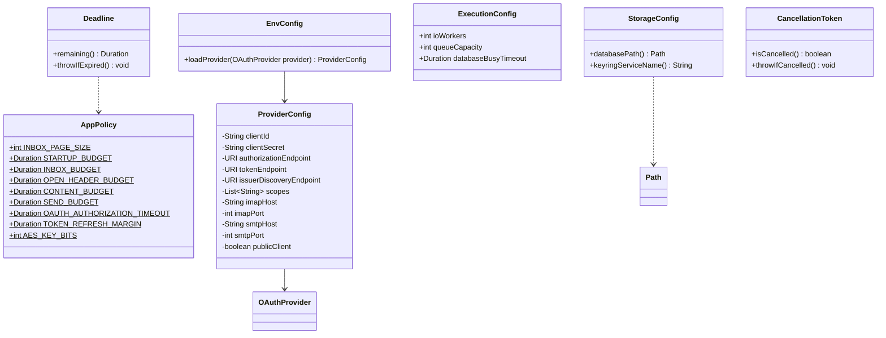

# Configuración final

**Diseño objetivo del MVP de Evermail en Java 21.** Este documento especifica cómo debe quedar la aplicación; no afirma que el código actual ya lo implemente. Alcance: sesión OAuth2, bandeja, lectura, composición de correos nuevos, envío y caché local. Los demás diagramas de esta carpeta forman el mismo diseño.

El sufijo $ indica constantes estáticas. Configuración validada e inmutable; no conserva contraseñas de correo. Java 21 se utiliza para ejecutar Gradle y la aplicación.

| Política | Valor |
|---|---|
| INBOX_PAGE_SIZE | 50 |
| STARTUP_BUDGET | 5 s |
| INBOX_BUDGET | 30 s por operación de carga/refresco |
| OPEN_HEADER_BUDGET | 2 s |
| CONTENT_BUDGET | 30 s adicionales |
| SEND_BUDGET | 60 s |
| OAUTH_AUTHORIZATION_TIMEOUT | 3 min, cancelable |
| TOKEN_REFRESH_MARGIN | 60 s |
| AES_KEY_BITS | 256 |

Los presupuestos son end-to-end e incluyen espera en cola. HTTP/IMAP/SMTP usan timeouts de conexión, lectura y escritura acotados al plazo restante y un mecanismo de cierre al vencer. No se reinicia el plazo en cada reintento.

EnvConfig carga variables del entorno y un .env opcional; valida solo el proveedor solicitado. Google utiliza el tipo de cliente de escritorio configurado y su secreto si el registro lo requiere. Microsoft utiliza cliente público, sin MICROSOFT_CLIENT_SECRET. Los endpoints y redirect loopback deben corresponder al registro real; se usa descubrimiento OIDC oficial para validar identidad y claves.

StorageConfig crea una ruta absoluta local en %APPDATA%/Evermail en Windows, fuera de la carpeta de trabajo. Si no puede resolver o escribir la ruta falla explícitamente. Windows es el entorno de referencia del MVP; otros sistemas requieren un adaptador validado.

ExecutionConfig define ejecutores acotados y un busy_timeout menor que el presupuesto local restante. No existe un pool SQLite ni DB_POOL_SIZE. Los tamaños de ejecutor se validan con mediciones, no se confunden con límites de rendimiento.

AppContext crea e inyecta configuración una vez. Los valores sensibles se excluyen de logs y diagnósticos.
