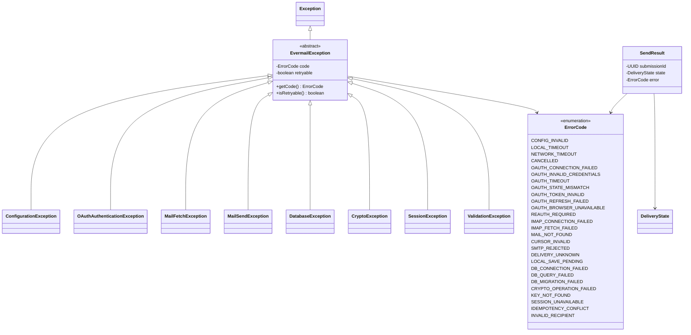

# Errores y resultados finales

**Diseño objetivo del MVP de Evermail en Java 21.** Este documento especifica cómo debe quedar la aplicación; no afirma que el código actual ya lo implemente. Alcance: sesión OAuth2, bandeja, lectura, composición de correos nuevos, envío y caché local. Los demás diagramas de esta carpeta forman el mismo diseño.

## Política de errores

Los constructores conservan código, causa y posibilidad de reintento. Los mensajes públicos se generan a partir del código; no contienen tokens, cuerpos, credenciales, respuestas OAuth completas ni rutas privadas. Los errores de validación son recuperables por el usuario y usan ValidationException; no hay una segunda jerarquía de errores de negocio no comprobados.

| Situación | Tratamiento |
|---|---|
| Red no disponible | Mostrar caché con estado offline; no borrar sesión ni correos. |
| Credenciales rechazadas | REAUTH_REQUIRED; conservar caché y clave para reautorizar. |
| Token renovado sin refresh_token nuevo | Conservar refresh_token anterior de la misma identidad. |
| Cursor de otra cuenta/generación | CURSOR_INVALID; refrescar, no mezclar páginas. |
| Cuerpo aún no descargado | Ausencia explícita en repositorio; obtener remoto. No es MAIL_NOT_FOUND. |
| Mensaje remoto eliminado | MAIL_NOT_FOUND y reconciliación de caché. |
| Fallo SQL | Rollback completo de la unidad de trabajo. |
| Migración fallida | Recuperación; no ejecutar consultas sobre esquema incompleto. |
| Clave ausente/cifrado inválido | KEY_NOT_FOUND/CRYPTO_OPERATION_FAILED; nunca generar reemplazo silencioso. |
| SMTP rechazó sin entrega | FAILED con SMTP_REJECTED; el usuario puede corregir y crear otro intento. |
| SMTP ambiguo o aceptación parcial | UNKNOWN con DELIVERY_UNKNOWN; no reenvío automático. |
| SMTP aceptado, falta registro local | LOCAL_SAVE_PENDING; conservar intento y recuperar sin repetir SMTP. |
| Repetición de submissionId con contenido distinto | IDEMPOTENCY_CONFLICT antes de conectar. |

Timeout/cancelación durante SMTP no demuestra ausencia de entrega. MailSendService devuelve SendResult cuando conoce el estado del intento; una excepción aislada no autoriza reenviar. Cancelar tareas de lectura sí permite reintento, mientras se valide cuenta y cursor.

Las fachadas transportan errores en Task.exception y los resultados de envío en Task.value. Los controladores muestran acciones coherentes con retryable y el estado de entrega; retryable nunca significa reintentar automáticamente un envío.
