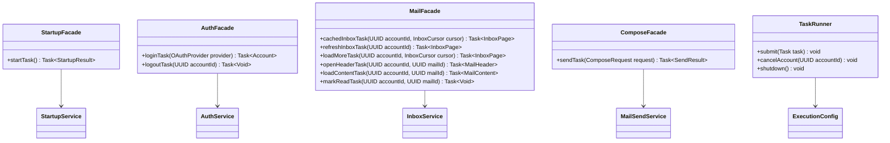

# Fachadas finales

**Diseño objetivo del MVP de Evermail en Java 21.** Este documento especifica cómo debe quedar la aplicación; no afirma que el código actual ya lo implemente. Alcance: sesión OAuth2, bandeja, lectura, composición de correos nuevos, envío y caché local. Los demás diagramas de esta carpeta forman el mismo diseño.

Las fachadas construyen Task sin iniciarlas, asignan Deadline según AppPolicy y adaptan resultados/errores. TaskRunner mantiene ejecutores acotados, con prioridad para apertura/caché frente a sincronización; no crea un hilo sin límite por clic. La interfaz nunca recibe Connection, Store, Transport ni OAuthCredentials.

## Contratos de interfaz

- cachedInboxTask permite pintar caché antes de refreshInboxTask. Solo una respuesta vigente para cuenta/cursor puede actualizar la vista.
- loadMoreTask agrega hasta 50 elementos únicos; no sustituye los anteriores.
- openHeaderTask usa el presupuesto de apertura de 2 s; loadContentTask el de 2 s adicionales. Un fallo muestra error/reintento, no contenido vacío simulado.
- loginTask usa el plazo humano OAuth separado del arranque.
- sendTask conserva submissionId; deshabilitar el botón evita dobles clics, pero la idempotencia se garantiza también en OutboxRepository.
- Los errores funcionales se entregan como SendResult cuando se conoce el estado de entrega. Otros errores aparecen en Task.exception y se muestran sin secretos.
- Cancelar una Task solicita cancelación al servicio y cierre de recursos. En envío no equivale a anular la entrega ni a autorizar otro intento.
- Al logout se descartan resultados tardíos y referencias a cuerpos/credenciales; TaskRunner coordina el cierre con AccountCoordinator.

No existen fachadas de etiquetas, descarga de adjuntos ni administración de borradores en el MVP final.
