# Repositorios finales

**Diseño objetivo del MVP de Evermail en Java 21.** Este documento especifica cómo debe quedar la aplicación; no afirma que el código actual ya lo implemente. Alcance: sesión OAuth2, bandeja, lectura, composición de correos nuevos, envío y caché local. Los demás diagramas de esta carpeta forman el mismo diseño.

```mermaid
classDiagram
    class AccountRepository {
        +find(UUID id) Account
        +findByIdentity(OAuthProvider provider, String subject) Account
        +listUsable() List~Account~
        +beginProvisioning(Identity identity, String keyRef) Account
        +activate(UUID id, OAuthCredentials credentials) Account
        +readCredentials(UUID id) OAuthCredentials
        +updateCredentials(UUID id, OAuthCredentials credentials) void
        +setStatus(UUID id, AccountStatus status) void
        +deleteLocal(UUID id) void
    }
    class MailRepository {
        +readInbox(UUID accountId, InboxCursor cursor, int size) InboxPage
        +findHeader(UUID accountId, UUID mailId) MailHeader
        +readContent(UUID accountId, UUID mailId) MailContent
        +saveInboxPage(UUID accountId, RemoteInboxPage page) InboxPage
        +saveContent(UUID accountId, UUID mailId, MailContent content) void
        +markRead(UUID accountId, UUID mailId) void
        +invalidateInbox(UUID accountId, long uidValidity) void
    }
    class OutboxRepository {
        +prepare(ComposeRequest request) OutboxMessage
        +find(UUID accountId, UUID submissionId) OutboxMessage
        +claim(UUID accountId, UUID submissionId) boolean
        +recordAccepted(UUID accountId, UUID id) void
        +recordFailure(UUID accountId, UUID id, ErrorCode error) void
        +recordUnknown(UUID accountId, UUID id, ErrorCode error) void
        +commitSent(UUID accountId, UUID id) SendResult
        +findRecoverable(UUID accountId) List~OutboxMessage~
    }
    AccountRepository --> AccountDAO
    MailRepository --> MailDAO
    MailRepository --> MailRecipientDAO
    MailRepository --> InboxStateDAO
    OutboxRepository --> OutboxDAO
    OutboxRepository --> OutboxRecipientDAO
    OutboxRepository --> MailDAO
    OutboxRepository --> MailRecipientDAO
    AccountRepository --> TransactionManager
    AccountRepository --> SecurityUtil
    AccountRepository --> KeyStoreService
    MailRepository --> TransactionManager
    MailRepository --> SecurityUtil
    MailRepository --> KeyStoreService
    OutboxRepository --> TransactionManager
    OutboxRepository --> SecurityUtil
    OutboxRepository --> KeyStoreService
```

## Responsabilidades y garantías

Los repositorios cifran antes de entrar a la transacción y descifran después de leer. Reciben modelos inmutables y crean Row separados; un fallo no modifica el objeto del llamador. Obtienen la clave por key_ref una vez por operación fuera del bloqueo SQL. Una clave puede mantenerse en memoria durante la sesión y se libera al cerrar sesión.

AccountRepository no crea ni destruye claves externas: AuthService coordina KeyStoreService y la persistencia. activate/updateCredentials solo aceptan credenciales con refresh_token utilizable, cifran con la clave existente y no rotan claves al reautorizar.

MailRepository solo devuelve INBOX en readInbox. readContent devuelve ausencia explícita si body_cipher es NULL, no texto vacío. saveInboxPage usa la identidad UID, mezcla sin duplicar y confirma cobertura solo para páginas completas. markRead es local, pertenece al Mail y no requiere etiquetas.

OutboxRepository.prepare valida idempotencia por submissionId y guarda contenido/destinatarios cifrados en una transacción. Si ya existe devuelve el mismo intento; si el contenido difiere rechaza la petición. claim compara PENDING → SENDING atómicamente. commitSent solo admite ACCEPTED o RECORDED y registra Mail SENT, destinatarios y estado RECORDED en una sola transacción.

## Consultas y concurrencia

Todo acceso exige accountId y verifica propiedad. No se devuelven tokens a la interfaz. Las mutaciones de una misma cuenta se coordinan además con AccountCoordinator; cerrar sesión espera/cancela operaciones conforme al contrato de servicios.

La cuenta DISCONNECTING deja de ser utilizable antes de limpiar datos. deleteLocal elimina primero referencias de enviados, después outbox y finalmente cuenta/dependientes, dentro de una transacción; así respeta la FK RESTRICT del ER. Debe poder repetirse.

No hay DraftRepository ni LabelRepository ni repositorio de adjuntos en el núcleo final del MVP. La composición vive en memoria y los enviados persistentes se registran mediante OutboxRepository.

Antes de commitSent se descifra el cuerpo del outbox y se cifra para el nuevo mailId/CryptoContext fuera de la transacción; no se copia un ciphertext autenticado para otro registro. La transacción vuelve a comprobar el estado e idempotencia antes de escribir.
