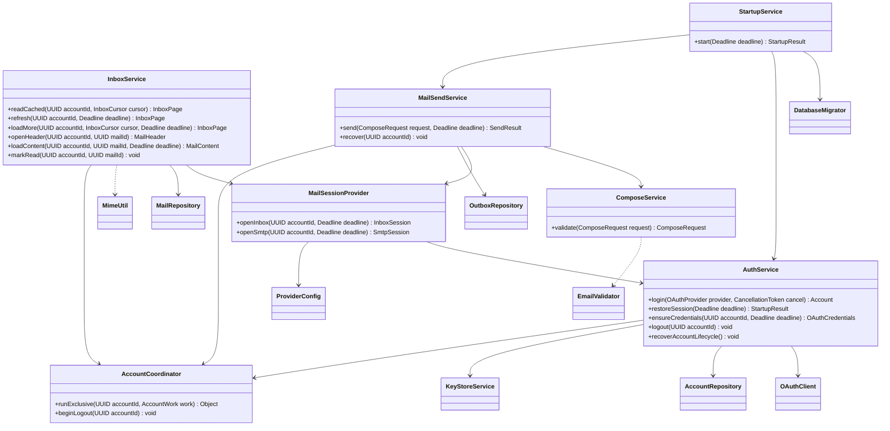
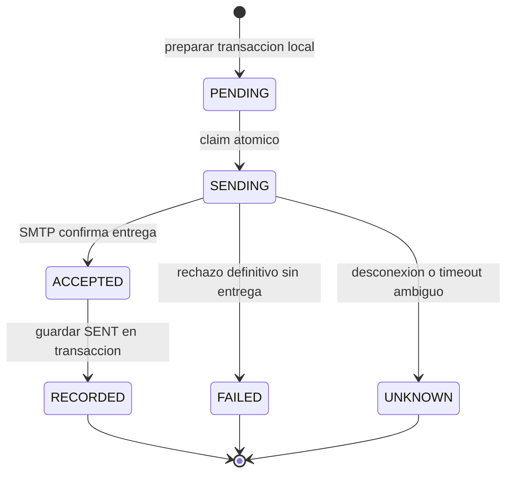

# Servicios finales

**Diseño objetivo del MVP de Evermail en Java 21.** Este documento especifica cómo debe quedar la aplicación; no afirma que el código actual ya lo implemente. Alcance: sesión OAuth2, bandeja, lectura, composición de correos nuevos, envío y caché local. Los demás diagramas de esta carpeta forman el mismo diseño.

## Sesión y arranque

StartupService prepara SQLite, recupera operaciones locales y devuelve estado antes del presupuesto de 5 s cuando el entorno lo permite; al agotarlo muestra un estado de recuperación/carga, nunca una sesión ficticia. La renovación de red no impide abrir una caché disponible; OFFLINE lo comunica.

OAuthClient implementa Authorization Code + PKCE y state, navegador externo y callback loopback. Valida emisor, audiencia, expiración y firma del ID token con claves del proveedor. El callback solo completa la operación con state correcto y código/error válido; peticiones ajenas no consumen el intento. Cierra servidor al finalizar/cancelar.

La identidad estable usa issuer + sub. Una reautorización reutiliza accountId y key_ref. Si falta refresh_token conserva el anterior de esa identidad; para una cuenta nueva exige consentimiento que lo proporcione o falla sin activar la cuenta.

Alta: persistir PROVISIONING con UUID y key_ref; crear clave externa; cifrar y activar. Si falla se compensan clave/fila. El arranque recupera PROVISIONING incompletos, sin mostrarlos como sesiones válidas.

La renovación se serializa por cuenta y vuelve a comprobar expiración tras obtener el turno; usa margen de 60 s. Fallos de red permiten caché offline; rechazo de autorización cambia a REAUTH_REQUIRED.

Logout bloquea nuevas operaciones y marca DISCONNECTING. Cancela descargas/renovaciones y espera cierre del trabajador SMTP o lo clasifica UNKNOWN antes de liberar recursos. Elimina la clave externa de forma idempotente y después los datos locales; un fallo conserva DISCONNECTING para reintentar limpieza en el próximo arranque. No se promete revocación remota de permisos OAuth.

## Bandeja y lectura

InboxSession usa IMAPS, propiedades mail.imaps.*, XOAUTH2, validación TLS, timeouts y cierre determinista. No descarga todo el buzón: usa UID, rangos y fetch de metadatos.

readCached no hace red. refresh trae los 50 más recientes, conserva cuerpos existentes y reconcilia los UID del intervalo visible. loadMore consulta una página local completa o recupera hasta 50 UID inferiores al cursor; confirma cobertura solo tras completar la página. Los nuevos mensajes no desplazan el cursor de páginas anteriores. Un UIDVALIDITY distinto invalida cursores y obliga a refrescar.

openHeader lee caché; loadContent lee primero el cuerpo local y, si falta, obtiene el mensaje por UID. HybridMime conserva HTML/texto y resuelve imágenes CID acotadas; no descarga adjuntos ordinarios ni imágenes remotas. reloadContent permite recuperar formato explícitamente conservando texto antiguo durante aperturas normales. Si el mensaje dejó de existir informa MAIL_NOT_FOUND y actualiza caché. La lectura se marca localmente al mostrar contenido. MailPresentationService prepara HTML seguro bajo el mismo Deadline.

## Envío y recuperación

ComposeService exige destinatarios válidos y resuelve duplicados antes de guardar o conectar. SmtpSession usa XOAUTH2 y STARTTLS obligatorio con validación de servidor. El mensaje y Message-ID se construyen una vez por submissionId.

FAILED solo se utiliza si se sabe que no hubo entrega a ningún destinatario. Aceptación parcial o pérdida de respuesta después de transmitir datos produce UNKNOWN. SmtpSession deshabilita envío parcial cuando el servidor rechaza destinatarios antes de DATA; aun así trata respuestas ambiguas sin reenviar.

No se devuelve ACCEPTED sin persistir esa confirmación. Si la confirmación SMTP llegó pero falla el guardado local, se informa resultado incierto/local pendiente y no se repite SMTP. Tras reiniciar, SENDING se convierte en UNKNOWN; ACCEPTED se registra localmente sin enviar otra vez. PENDING solo continúa mediante una acción explícita. UNKNOWN nunca se reintenta automáticamente. No es posible garantizar exactamente una entrega entre SMTP y SQLite.

El presupuesto de envío es 4 s. Agotarlo actualiza la interfaz y solicita interrupción/cierre del transporte; no libera el bloqueo del intento mientras siga activo el trabajador ni presupone que el servidor no recibió el mensaje.

## Ejecución

Todos los servicios son síncronos, sin JavaFX. Deadline es un plazo absoluto compartido: cada paso usa el tiempo restante, no reinicia el presupuesto. AccountWork abrevia una función genérica; AccountCoordinator no mantiene transacciones SQL durante red. El planificador permite que una lectura de caché no espere a una sincronización de red; la exclusión se aplica a renovación, envío, logout y confirmaciones de cambios incompatibles.
