# Utilidades, cifrado y adaptadores

**Diseño objetivo del MVP de Evermail en Java 21.** Este documento especifica cómo debe quedar la aplicación; no afirma que el código actual ya lo implemente. Alcance: sesión OAuth2, bandeja, lectura, composición de correos nuevos, envío y caché local. Los demás diagramas de esta carpeta forman el mismo diseño.

```mermaid
classDiagram
    class EmailValidator {
        +normalize(String email) String$
        +validateRecipients(List~Recipient~ recipients) List~Recipient~$
    }
    class MimeUtil {
        +extractReadableText(MimeMessage message) String$
        +extractHeader(MimeMessage message, RemoteMailId remoteId) RemoteMailHeader$
        +extractRecipients(MimeMessage message) List~Recipient~$
    }
    class HybridMime {
        +extract(Part message, Deadline deadline) RemoteMailContent$
    }
    class HtmlMail {
        +sanitize(String raw, ImageResolver resolver, Deadline deadline) SafeBody$
        +document(String safeHtml) String$
    }
    class InlineImages {
        +dataUri(byte[] bytes) String$
        +validateDataUri(String uri) String$
    }
    class DateUtil {
        +format(Instant instant, ZoneId zone) String$
    }
    class SecurityUtil {
        +generateKey() SecretKey
        +encrypt(String plainText, SecretKey key, CryptoContext context) String
        +decrypt(String envelope, SecretKey key, CryptoContext context) String
    }
    class CryptoContext {
        -UUID accountId
        -UUID recordId
        -String fieldName
    }
    class KeyStoreService {
        +create(String keyRef) void
        +read(String keyRef) SecretKey
        +delete(String keyRef) void
    }
    class OAuthClient {
        +authorize(ProviderConfig config, CancellationToken cancel) AuthorizationResult
        +refresh(ProviderConfig config, OAuthCredentials credentials, Deadline deadline) OAuthCredentials
    }
    class InboxSession {
        +fetchLatest(int limit, Deadline deadline) RemoteInboxPage
        +fetchBefore(InboxCursor cursor, int limit, Deadline deadline) RemoteInboxPage
        +fetchContent(RemoteMailId id, Deadline deadline) RemoteMailContent
        +close() void
    }
    class SmtpSession {
        +submit(OutboxMessage message, Deadline deadline) SmtpOutcome
        +close() void
    }
    SecurityUtil --> CryptoContext
    KeyStoreService --> SecurityUtil : genera clave
    KeyStoreService --> Keyring
    OAuthClient --> ProviderConfig
    InboxSession ..> HybridMime
    HybridMime ..> MimeUtil
    HybridMime ..> HtmlMail
    HybridMime ..> InlineImages
    SmtpSession ..> OutboxMessage
```

El sufijo $ indica métodos estáticos. OAuthClient, InboxSession y SmtpSession son adaptadores de protocolo del paquete service, mostrados aquí para completar los contratos consumidos por los servicios; no se ubican en util. KeyStoreService pertenece a infraestructura de seguridad.

AuthorizationResult contiene identidad validada y OAuthCredentials. RemoteInboxPage contiene UIDVALIDITY, intervalo inspeccionado, metadatos/destinatarios, extremos y hasMore. SmtpOutcome distingue aceptación total, rechazo sin entrega e incertidumbre/aceptación parcial. RemoteMailHeader contiene metadatos remotos sin UUID local; RemoteMailContent contiene texto y destinatarios sin mailId. El servicio/repositorio los vincula a la cuenta y a los UUID locales. Son valores de transporte, no tablas.

## Cifrado

AES-256-GCM utiliza nonce aleatorio nuevo de 12 bytes y etiqueta de 128 bits por operación. El sobre versionado codificado en Base64 incluye versión, nonce y ciphertext/tag. CryptoContext se autentica como AAD (cuenta, registro y campo) para impedir intercambiar valores cifrados entre registros.

KeyStoreService usa una referencia UUID independiente del correo y de IDs incrementales. create nunca sobrescribe una clave existente; read falla explícitamente si no existe; delete es idempotente. Reautenticar o renovar tokens nunca cambia la clave. El importador de legado reconoce el formato anterior y lo recifra de forma controlada, sin tratar cualquier fallo de autenticidad como formato antiguo.

Se limita la vida de credenciales y cuerpos descifrados; no se incluyen en toString ni excepciones. El cifrado de campos no equivale a cifrar toda SQLite.

## MIME, direcciones y red

HybridMime recorre multipart con límites, conserva text/plain y text/html, resuelve imágenes CID referenciadas y respeta charset. MimeUtil mantiene la conversión a texto y extracción de destinatarios. HtmlMail limpia HTML y CSS con una lista permitida; InlineImages valida imágenes raster acotadas. Se omiten adjuntos ordinarios y recursos externos. Véase [lectura híbrida](../../notas-tecnicas/html-reading.md).

EmailValidator utiliza análisis de direcciones estructurado, conserva el local-part y normaliza el dominio/espacios. Consolida duplicados del mismo rol y rechaza roles contradictorios antes de SMTP. No aplica reglas privadas de un proveedor a todas las direcciones.

InboxSession obtiene contenido por UID y UIDVALIDITY; no recorre todo el buzón ni identifica mensajes exclusivamente por Message-ID. SmtpSession construye el mensaje con Message-ID estable, omite BCC de encabezados transmitidos y sí los incluye en el sobre de destinatarios.

No hay FileUtil de descarga ni almacenamiento de adjuntos en el MVP final. Evitar incorporar esa función elimina sus rutas remotas y colisiones del flujo objetivo, sin exigir modificarla como requisito del MVP.
