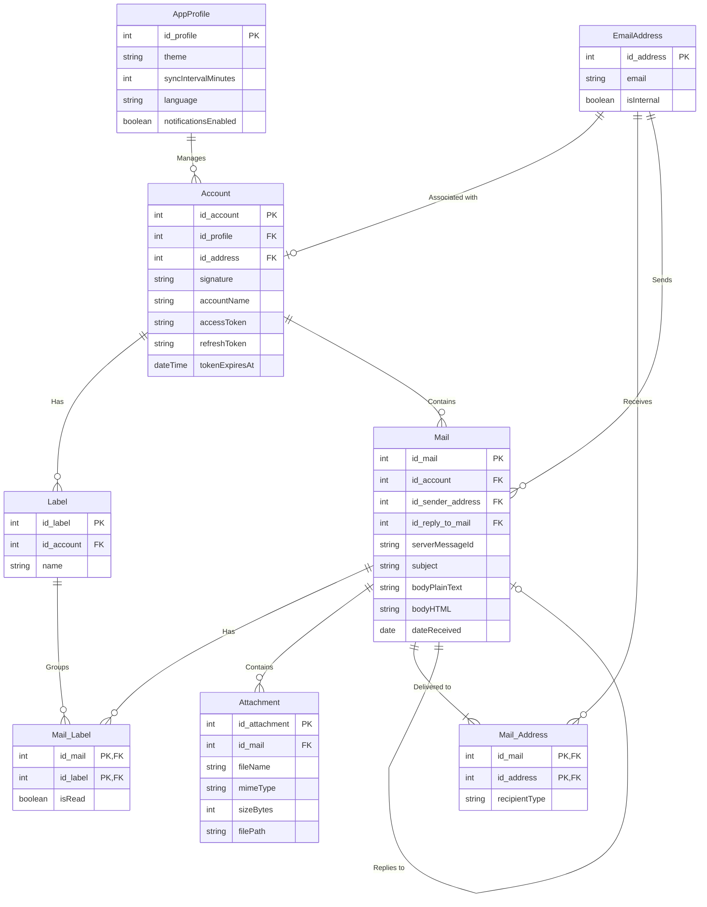

**Key syntax used here:**
- `||--o{`: One-to-Zero-or-Many relationship.
- `||--|{`: One-to-One-or-Many relationship (mandatory).
- `||--||`: One-to-One relationship.
- `|o--o{`: Zero-or-One-to-Zero-or-Many relationship.
