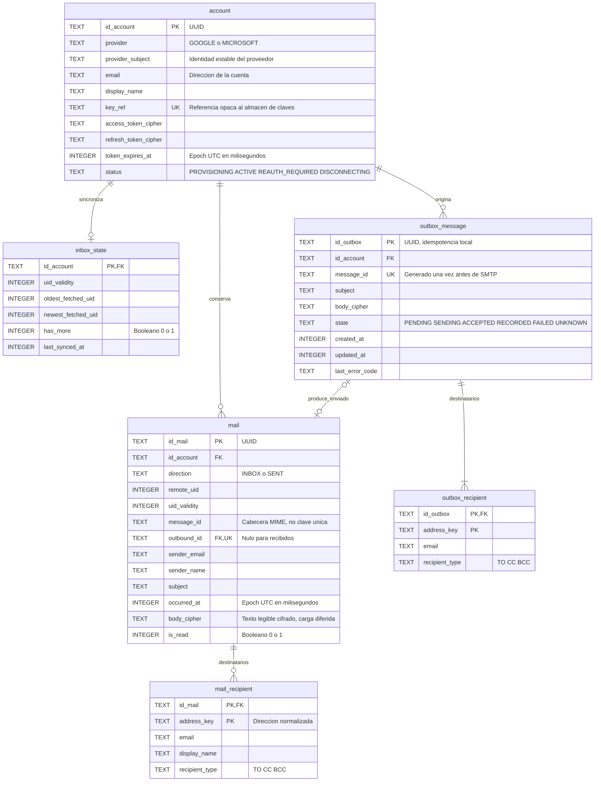

# Modelo entidad-relación final

**Diseño objetivo del MVP de Evermail en Java 21.** Este documento especifica cómo debe quedar la aplicación; no afirma que el código actual ya lo implemente. Alcance: sesión OAuth2, bandeja, lectura, composición de correos nuevos, envío y caché local. Los demás diagramas de esta carpeta forman el mismo diseño.

```mermaid
erDiagram
    account {
        TEXT id_account PK "UUID"
        TEXT provider "GOOGLE o MICROSOFT"
        TEXT provider_subject "Identidad estable del proveedor"
        TEXT email "Direccion de la cuenta"
        TEXT display_name
        TEXT key_ref UK "Referencia opaca al almacen de claves"
        TEXT access_token_cipher
        TEXT refresh_token_cipher
        INTEGER token_expires_at "Epoch UTC en milisegundos"
        TEXT status "PROVISIONING ACTIVE REAUTH_REQUIRED DISCONNECTING"
    }
    inbox_state {
        TEXT id_account PK, FK
        INTEGER uid_validity
        INTEGER oldest_fetched_uid
        INTEGER newest_fetched_uid
        INTEGER has_more "Booleano 0 o 1"
        INTEGER last_synced_at
    }
    mail {
        TEXT id_mail PK "UUID"
        TEXT id_account FK
        TEXT direction "INBOX o SENT"
        INTEGER remote_uid
        INTEGER uid_validity
        TEXT message_id "Cabecera MIME, no clave unica"
        TEXT outbound_id FK, UK "Nulo para recibidos"
        TEXT sender_email
        TEXT sender_name
        TEXT subject
        INTEGER occurred_at "Epoch UTC en milisegundos"
        TEXT body_cipher "Texto legible cifrado, carga diferida"
        INTEGER is_read "Booleano 0 o 1"
    }
    mail_recipient {
        TEXT id_mail PK, FK
        TEXT address_key PK "Direccion normalizada"
        TEXT email
        TEXT display_name
        TEXT recipient_type "TO CC BCC"
    }
    outbox_message {
        TEXT id_outbox PK "UUID, idempotencia local"
        TEXT id_account FK
        TEXT message_id UK "Generado una vez antes de SMTP"
        TEXT subject
        TEXT body_cipher
        TEXT state "PENDING SENDING ACCEPTED RECORDED FAILED UNKNOWN"
        INTEGER created_at
        INTEGER updated_at
        TEXT last_error_code
    }
    outbox_recipient {
        TEXT id_outbox PK, FK
        TEXT address_key PK
        TEXT email
        TEXT recipient_type "TO CC BCC"
    }
    account ||--o| inbox_state : sincroniza
    account ||--o{ mail : conserva
    account ||--o{ outbox_message : origina
    mail ||--o{ mail_recipient : destinatarios
    outbox_message ||--|{ outbox_recipient : destinatarios
    outbox_message |o--o| mail : produce_enviado
```

## Claves, nulabilidad y restricciones

- Todas las PK UUID se generan antes de persistir. provider_subject identifica al usuario mediante issuer + sub; no se usa el correo mutable como identidad. UNIQUE(provider, provider_subject).
- account: display_name y tokens/expiración admiten NULL durante PROVISIONING o DISCONNECTING. ACTIVE exige access_token_cipher, refresh_token_cipher y token_expires_at no nulos. REAUTH_REQUIRED puede conservar los tokens anteriores para recuperar la cuenta.
- inbox_state puede no existir hasta la primera sincronización. uid_validity es obligatorio; los límites oldest/newest y last_synced_at son NULL hasta disponer de un intervalo sincronizado. Los UID usan enteros de 64 bits positivos.
- mail: direction, sender_email, occurred_at e is_read son obligatorios. subject se normaliza a cadena vacía. sender_name, message_id y body_cipher son opcionales. body_cipher NULL significa contenido aún no descargado; un cuerpo vacío descargado se cifra como cadena vacía.
- INBOX exige remote_uid y uid_validity positivos y outbound_id NULL. UNIQUE(id_account, uid_validity, remote_uid) WHERE direction = 'INBOX'.
- SENT exige outbound_id no nulo y remote_uid/uid_validity NULL. Cada outbox produce como máximo un Mail; ambos deben pertenecer a la misma cuenta. Esta pertenencia y la dirección se verifican dentro de la transacción de registro.
- outbox_message exige cuerpo, asunto, message_id y fechas; last_error_code es opcional. Un registro listo para envío tiene al menos un destinatario, condición comprobada en la transacción de creación.
- Las parejas PK de destinatarios impiden repetir una dirección en distintos roles. Antes de enviar se rechaza la misma dirección con roles diferentes; repeticiones dentro del mismo rol se consolidan. Al importar correo se consolida con precedencia TO, CC, BCC.
- address_key normaliza espacios exteriores y dominio con reglas IDN, conservando el local-part. No elimina puntos ni sufijos '+' ni presupone reglas de Gmail para todos los dominios.
- Los booleanos llevan CHECK IN (0,1); provider, direction, status, state y recipient_type usan CHECK con los valores indicados.
- Todas las FK dependientes de account usan ON DELETE CASCADE; las filas de destinatarios también. mail.outbound_id usa ON DELETE RESTRICT: un registro de envío no se elimina mientras lo referencia un correo, salvo limpieza completa de cuenta coordinada.
- Índices: mail(id_account, direction, remote_uid DESC), outbox_message(id_account, state, created_at). Todos los filtros de caché incluyen id_account.

## Persistencia y privacidad

SQLite almacena tokens, cuerpos de correo y contenido pendiente de envío cifrados con AES-256-GCM. La clave de cuenta vive exclusivamente en el almacén del sistema bajo key_ref. El nonce y etiqueta viajan en un sobre versionado; los metadatos restantes no están cifrados.

No hay tablas de etiquetas, adjuntos, contactos compartidos ni borradores persistentes: no son necesarias para este MVP. ComposeRequest vive en memoria hasta enviar; outbox_message es un registro de entrega y recuperación, no una pantalla de enviados ni de borradores.

## Reglas de caché y migración

inbox_state describe un intervalo completo de UID inspeccionado, incluidos huecos por mensajes eliminados. Los límites solo avanzan al confirmar una página completa; una descarga interrumpida no marca cobertura completa. La paginación ordena por UID descendente, siempre bajo el mismo UIDVALIDITY, y devuelve 50 como máximo.

Si cambia UIDVALIDITY se invalida únicamente la caché INBOX y su cursor dentro de una transacción; los SENT permanecen. Un mensaje que sale de INBOX deja de aparecer al reconciliar los UID del intervalo visible. La caché desconectada puede ser antigua y la interfaz debe indicarlo.

Las fechas se conservan como instantes UTC; INBOX usa INTERNALDATE de IMAP y SENT la confirmación de entrega al servidor. El orden de la bandeja sigue el del buzón (UID), sin depender de fechas de remitentes.

DatabaseMigrator crea y actualiza el esquema con PRAGMA user_version y transacciones. La migración de datos anteriores conserva cifrados y claves, convierte fechas antiguas de forma documentada y nunca inventa UID para filas existentes: las filas recibidas sin identidad remota se reconcilian antes de incorporarlas al nuevo índice. No se borra la base para actualizarla. El importador de legado es específico de versión y no forma parte de las entidades finales.

Si refresh detecta un hueco entre la página más reciente y la cobertura antigua, reinicia la cobertura declarada al intervalo nuevo; conserva los cuerpos en caché pero no declara completo el hueco. loadMore lo recorre antes de reutilizar páginas antiguas. has_more solo es falso cuando una respuesta completa del servidor confirma el final.
