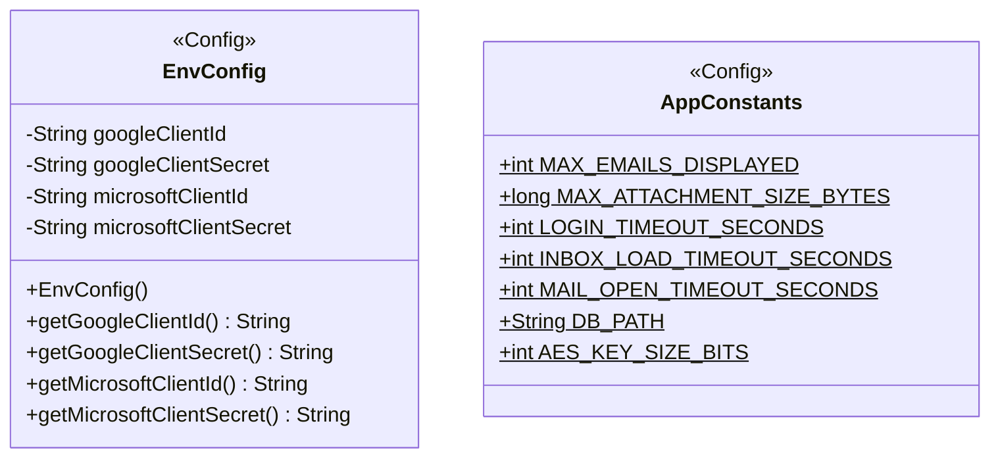

**Key syntax used here:**
- `<<Config>>`: Stereotype marking configuration classes with no domain identity of their own.
- `$`: Suffix denoting a **static** member (classifier) in Mermaid — used on every attribute of `AppConstants`.
- `-`, `+`: Access modifiers (Private, Public).

**Design notes:**

1. `EnvConfig` requires a constructor: upon instantiation, it loads the `.env` file once (via `dotenv-java`) and caches the values as private instance attributes. The `get...()` methods only return what is already loaded in memory, avoiding repeated disk reads — prioritizing low CPU/memory consumption.

2. `AppConstants` has no constructor and is never instantiated: all of its members are `static final`, defined at compile time or resolved once at classloading, with no external dependencies.

3. `EnvConfig` is intended to be instantiated only once during application startup (ideally as a Singleton or manually injected a single time where needed), to guarantee that the `.env` file is not read more than once during Evermail's entire lifecycle. This pattern decision (Singleton vs. manual injection) remains open until implementation time, without affecting the current diagram.

4. The values in `AppConstants` come directly from the non-functional requirements already defined in `MVP_Evermail.md` (login, inbox, and mail-open loading times) and from the limits used by `FileUtil.validateSize` in the `util` package.

5. `DB_PATH` is consumed by `SqliteConnectionProvider` (`repository` package) to open the single shared SQLite connection at startup. For the Windows-only prototype it resolves to `System.getenv("APPDATA") + "\\Evermail\\evermail.db"` — an absolute, OS-appropriate path, not a hardcoded relative literal. Multiplatform detection (macOS/Linux) is deferred as a documented TODO: adding untested branches for platforms not available during development is worse than adding them later, validated, when that work is actually undertaken.

6. **`DB_POOL_SIZE` was removed.** It was originally added assuming `SqliteConnectionProvider` would manage a pool of several connections, the way a client-server database (Postgres, MySQL) would. That assumption doesn't hold for SQLite: the file allows only one writer at a time regardless of how many connections are open, so a multi-connection pool would not provide the expected parallelism — it would only add contention. The implemented design uses a **single shared `Connection`**, with concurrent access from multiple `Task` threads serialized via `synchronized` blocks in each DAO (see `uml-dao.md`, note 7). If a future profiling pass shows this serialization is a real bottleneck, the next step to consider is WAL mode with a dedicated read-only connection — not a naive connection pool.

7. **Security update:** `AES_KEY_SIZE_BITS` centralizes the AES key size used by `SecurityUtil` for token, mail-body, and attachment encryption (see `uml-util.md`). Keeping this value here, rather than hardcoding `256` directly inside `SecurityUtil.generateAesKey()`, follows the same reasoning as note 5: any fixed cryptographic parameter that is not itself a secret belongs in static configuration.