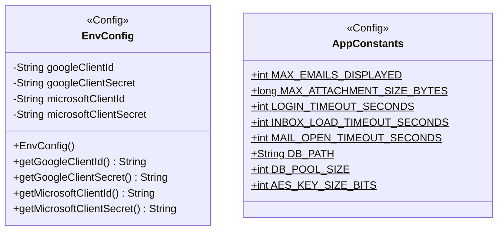

**Key syntax used here:**
- `<<Config>>`: Stereotype marking configuration classes with no domain identity of their own.
- `$`: Suffix denoting a **static** member (classifier) in Mermaid — used on every attribute of `AppConstants`.
- `-`, `+`: Access modifiers (Private, Public).

**Design notes:**

1. `EnvConfig` requires a constructor: upon instantiation, it loads the `.env` file once (via `dotenv-java`) and caches the values as private instance attributes. The `get...()` methods only return what is already loaded in memory, avoiding repeated disk reads — prioritizing low CPU/memory consumption.

2. `AppConstants` has no constructor and is never instantiated: all of its members are `static final`, defined at compile time, with no external dependencies.

3. `EnvConfig` is intended to be instantiated only once during application startup (ideally as a Singleton or manually injected a single time where needed), to guarantee that the `.env` file is not read more than once during Evermail's entire lifecycle. This pattern decision (Singleton vs. manual injection) remains open until implementation time, without affecting the current diagram.

4. The values in `AppConstants` come directly from the non-functional requirements already defined in `MVP_Evermail.md` (login, inbox, and mail-open loading times) and from the limits used by `FileUtil.validateSize` in the `util` package.

5. `DB_PATH` and `DB_POOL_SIZE` were added to be consumed by `SqliteConnectionProvider` (`repository` package), which initializes the SQLite connection pool once at startup. Keeping these values in `AppConstants` (instead of hardcoding them in `SqliteConnectionProvider`) is consistent with the rest of the diagram: any fixed value that does not depend on user credentials lives in static configuration, not in the class that consumes it.

6. **Security update:** `AES_KEY_SIZE_BITS` was added to centralize the AES key size used by `SecurityUtil` for both token and content encryption (see `Diagrama_UML_Util.md`, note 6). Keeping this value here, rather than hardcoding `256` directly inside `SecurityUtil.generateAesKey()`, follows the same reasoning as note 5: any fixed cryptographic parameter that is not itself a secret belongs in static configuration.
