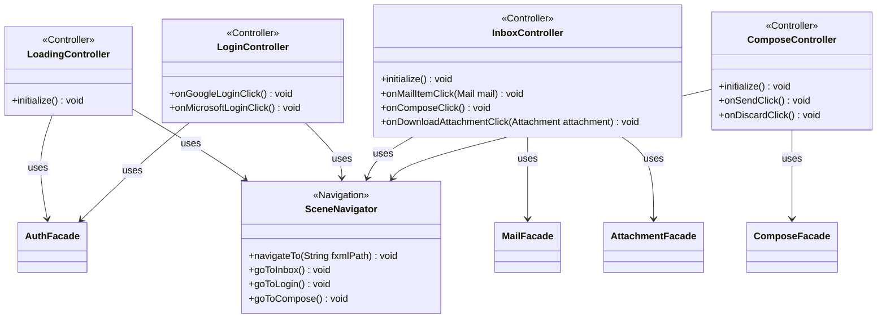

**Key syntax used here:**
- `<<Controller>>`: Stereotype marking JavaFX classes bound 1:1 to an `.fxml` file, responsible only for UI events and for invoking the corresponding `facade`.
- `<<Navigation>>`: Stereotype for `SceneNavigator`, a class that centralizes scene/screen changes, with no business logic.
- `-->`: **Association/Usage.** The Controller holds an injected reference toward the referenced class.
- `-`, `+`: Access modifiers (Private, Public).

**Design notes:**

1. `SceneNavigator` is the only class shared among the 4 controllers: it centralizes `loadFXML`/JavaFX `Scene` switching, preventing each controller from repeating `.fxml` loading logic or handling hardcoded paths — if the view folder structure changes tomorrow, only this class needs to be modified.

2. `LoadingController.initialize()` is the application's single entry point: it checks whether a saved session exists (via `AuthFacade`, internally reusing `refreshTokenIfNeeded` in `AuthService`) and automatically navigates to `Inbox` if the session is valid, or to `Login` if not — fulfilling the MVP's non-functional requirement of a loading screen that resolves connections before showing content to the user.

3. `InboxController` is the controller with the most responsibilities because, per the Figma flow, the "open mail" view (including its mixed HTML/plain-text content and its attachments) lives inside the same inbox screen, not in a separate controller. HTML body rendering is handled directly with a JavaFX `WebView` embedded in that view — it requires no additional method in `MimeUtil`, since `MimeUtil.extractPlainText()` (defined in `util`) already delivers the plain text, and `bodyHTML` already comes resolved from the `Mail` model to be passed as-is to the `WebView`.

4. `onDownloadAttachmentClick()` in `InboxController` is the only place where `AttachmentFacade` is used — nothing is downloaded when opening a mail (on-demand download, already defined in `FileUtil`/`AttachmentService`), only when the user explicitly clicks on an attachment.

5. No controller is aware of classes from `service`, `repository`, or `dao` — its only entry point into business logic is the corresponding `facade`, closing the full unidirectional dependency chain: `controller → facade → service → repository → dao`.
