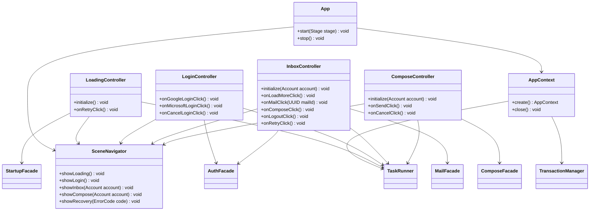
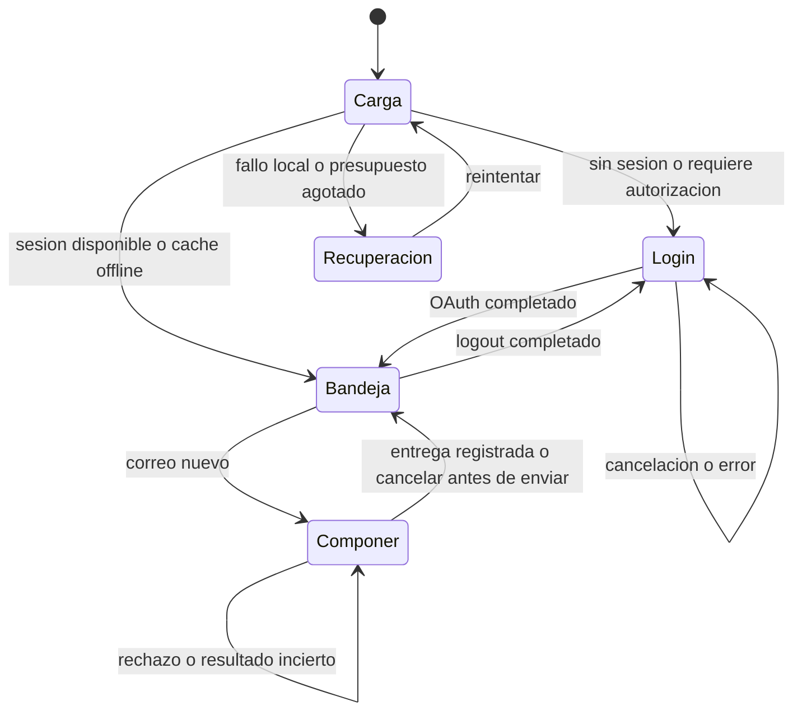

# Interfaz y navegación finales

**Diseño objetivo del MVP de Evermail en Java 21.** Este documento especifica cómo debe quedar la aplicación; no afirma que el código actual ya lo implemente. Alcance: sesión OAuth2, bandeja, lectura, composición de correos nuevos, envío y caché local. Los demás diagramas de esta carpeta forman el mismo diseño.

```mermaid
classDiagram
    class App {
        +start(Stage stage) void
        +stop() void
    }
    class AppContext {
        +create() AppContext
        +close() void
    }
    class SceneNavigator {
        +showLoading() void
        +showLogin() void
        +showInbox(Account account) void
        +showCompose(Account account) void
        +showRecovery(ErrorCode code) void
    }
    class LoadingController {
        +initialize() void
        +onRetryClick() void
    }
    class LoginController {
        +onGoogleLoginClick() void
        +onMicrosoftLoginClick() void
        +onCancelLoginClick() void
    }
    class InboxController {
        +initialize(Account account) void
        +onLoadMoreClick() void
        +onMailClick(UUID mailId) void
        +onComposeClick() void
        +onLogoutClick() void
        +onRetryClick() void
    }
    class ComposeController {
        +initialize(Account account) void
        +onSendClick() void
        +onCancelClick() void
    }
    App --> AppContext
    App --> SceneNavigator
    AppContext --> TaskRunner
    AppContext --> TransactionManager
    LoadingController --> StartupFacade
    LoginController --> AuthFacade
    InboxController --> MailFacade
    InboxController --> AuthFacade
    ComposeController --> ComposeFacade
    LoadingController --> SceneNavigator
    LoadingController --> TaskRunner
    LoginController --> SceneNavigator
    LoginController --> TaskRunner
    InboxController --> SceneNavigator
    InboxController --> TaskRunner
    ComposeController --> SceneNavigator
    ComposeController --> TaskRunner
```

AppContext construye una sola instancia de infraestructura y colaboradores e inyecta controladores mediante FXMLLoader.controllerFactory. App.stop cierra tareas, transportes y conexión. SceneNavigator concentra rutas FXML; los controladores no acceden directamente a repositorios, protocolos ni secretos.

```mermaid
stateDiagram-v2
    [*] --> Carga
    Carga --> Login : sin sesion o requiere autorizacion
    Carga --> Bandeja : sesion disponible o cache offline
    Carga --> Recuperacion : fallo local o presupuesto agotado
    Recuperacion --> Carga : reintentar
    Login --> Bandeja : OAuth completado
    Login --> Login : cancelacion o error
    Bandeja --> Componer : correo nuevo
    Componer --> Bandeja : entrega registrada o cancelar antes de enviar
    Componer --> Componer : rechazo o resultado incierto
    Bandeja --> Login : logout completado
```

## Comportamiento requerido

- Carga tiene presupuesto de 5 s. Una espera que lo exceda cambia a recuperación con información explícita; no bloquea indefinidamente ni garantiza éxito ante un disco averiado.
- Login utiliza el navegador del sistema; cancelar cierra el intento OAuth sin afectar otras cuentas.
- Bandeja muestra inicialmente los 50 más recientes; pinta caché disponible y actualiza sin duplicar. Indica modo offline/caché antigua. Cargar más agrega otros 50 y conserva selección/posición; si no hay más se deshabilita.
- El contenido se abre en dos etapas: encabezado en 2 s y contenido en otros 2. MailReaderPane ofrece HTML seguro mediante WebView sin JavaScript, alternativa de texto y recursos externos bloqueados. La preparación comparte el plazo del contenido y ocurre fuera del hilo JavaFX. La integración con la bandeja sigue pendiente; véase [lectura híbrida](../html-reading.md).
- Componer admite destinatarios y texto de un correo nuevo. Mantiene ComposeRequest en memoria; cancelar antes de enviar descarta esa edición. No hay pantalla de borradores.
- Al enviar conserva submissionId y evita edición/repetición mientras el resultado está pendiente. Un resultado UNKNOWN informa que pudo entregarse y no ofrece reenvío automático. Tras rechazo definitivo, corregir/enviar crea una nueva solicitud explícita.
- Cerrar una vista durante SMTP no implica cancelar un correo ya transmitido. El estado sigue registrado y se recupera conforme al UML de servicios.
- Logout limpia selección/contenido y cancela resultados tardíos; si la limpieza local falla se muestra recuperación y la cuenta permanece DISCONNECTING.

## Alcance y tiempos

No se añaden pantallas de enviados, etiquetas, contactos, respuestas ni adjuntos. Guardar enviados es persistencia interna. Los presupuestos vigentes son arranque 5 s, bandeja 5 s, lectura 2 + 2 s y envío 4 s. Son criterios a medir en un entorno de referencia, no una garantía sobre redes externas. La interfaz siempre debe distinguir éxito, espera, offline y error.
