```mermaid
classDiagram
    class SqliteConnectionProvider {
        <<Repository>>
        +SqliteConnectionProvider()
        +getConnection() Connection
    }

    class AccountDAO {
        <<DAO>>
        +findById(int idAccount) Account
        +findAll() List~Account~
        +insert(Account account) int
        +update(Account account) void
        +delete(int idAccount) void
    }

    class AppProfileDAO {
        <<DAO>>
        +findById(int idProfile) AppProfile
        +insert(AppProfile profile) int
        +update(AppProfile profile) void
        +delete(int idProfile) void
    }

    class EmailAddressDAO {
        <<DAO>>
        +findById(int idAddress) EmailAddress
        +findByEmail(String email) EmailAddress
        +insert(EmailAddress address) int
        +delete(int idAddress) void
    }

    class MailDAO {
        <<DAO>>
        +findById(int idMail) Mail
        +findByAccount(int idAccount, int limit) List~Mail~
        +insert(Mail mail) int
        +delete(int idMail) void
    }

    class AttachmentDAO {
        <<DAO>>
        +findByMail(int idMail) List~Attachment~
        +insert(Attachment attachment) int
        +delete(int idAttachment) void
    }

    class LabelDAO {
        <<DAO>>
        +findById(int idLabel) Label
        +findByAccount(int idAccount) List~Label~
        +insert(Label label) int
        +delete(int idLabel) void
    }

    class MailLabelDAO {
        <<DAO>>
        +findByMail(int idMail) List~MailLabel~
        +insert(MailLabel mailLabel) void
        +updateIsRead(int idMail, int idLabel, boolean isRead) void
        +delete(int idMail, int idLabel) void
    }

    class MailAddressDAO {
        <<DAO>>
        +findByMail(int idMail) List~MailAddress~
        +insertBatch(List~MailAddress~ addresses) void
        +delete(int idMail) void
    }

    class DraftDAO {
        <<DAO>>
        +findById(int idDraft) Draft
        +findByAccount(int idAccount) List~Draft~
        +insert(Draft draft) int
        +update(Draft draft) void
        +delete(int idDraft) void
    }

    class DraftAddressDAO {
        <<DAO>>
        +findByDraft(int idDraft) List~DraftAddress~
        +insertBatch(List~DraftAddress~ addresses) void
        +delete(int idDraft) void
    }

    %% Shared dependency toward the connection
    AccountDAO --> SqliteConnectionProvider : uses
    AppProfileDAO --> SqliteConnectionProvider : uses
    EmailAddressDAO --> SqliteConnectionProvider : uses
    MailDAO --> SqliteConnectionProvider : uses
    AttachmentDAO --> SqliteConnectionProvider : uses
    LabelDAO --> SqliteConnectionProvider : uses
    MailLabelDAO --> SqliteConnectionProvider : uses
    MailAddressDAO --> SqliteConnectionProvider : uses
    DraftDAO --> SqliteConnectionProvider : uses
    DraftAddressDAO --> SqliteConnectionProvider : uses

    %% Dependencies toward config
    SqliteConnectionProvider --> AppConstants : uses

    %% Dependencies toward util for encryption at rest
    MailDAO --> SecurityUtil : uses
    DraftDAO --> SecurityUtil : uses
    AttachmentDAO --> SecurityUtil : uses

    %% Dependencies toward exception (throws)
    AccountDAO ..> DatabaseException : throws
    AppProfileDAO ..> DatabaseException : throws
    EmailAddressDAO ..> DatabaseException : throws
    MailDAO ..> DatabaseException : throws
    AttachmentDAO ..> DatabaseException : throws
    LabelDAO ..> DatabaseException : throws
    MailLabelDAO ..> DatabaseException : throws
    MailAddressDAO ..> DatabaseException : throws
    DraftDAO ..> DatabaseException : throws
    DraftAddressDAO ..> DatabaseException : throws
```

**Key syntax used here:**
- `<<DAO>>`: Stereotype marking classes with direct access to a physical SQLite table, with no domain logic.
- `<<Repository>>`: Stereotype reused here for `SqliteConnectionProvider`, since it manages a live resource (connection pool), just like `MailSessionProvider` in `service`.
- `-->`: **Association/Usage.** The source class holds an injected reference toward the referenced class.
- `..>`: **Dependency.** The source class throws the referenced exception.
- `-`, `+`: Access modifiers (Private, Public).

**Design notes:**

1. `SqliteConnectionProvider` centralizes the opening and reuse of SQLite connections (pool), initializing `DB_PATH` and `DB_POOL_SIZE` from `AppConstants` only once. All DAOs receive it injected via constructor, replicating the same pattern already used with `MailSessionProvider` in `service` — this prevents each DAO from opening its own connection and reduces resource consumption.

2. Each DAO corresponds exactly to one physical table in the E-R model, including intermediate tables (`MailLabelDAO`, `MailAddressDAO`, `DraftAddressDAO`), which expose batch methods (`insertBatch`) to minimize round-trips to the database when several related rows are saved at once (e.g., several recipients of the same mail).

3. `MailLabelDAO.updateIsRead()` exists as its own method (instead of a generic `update()`) because, per the E-R model, `isRead` is the only mutable field of that intermediate table — this optimizes the most common operation (marking read/unread) into a single targeted SQL statement, without needing to rebuild the entire row.

4. All DAOs throw only `DatabaseException` (with its corresponding `ErrorCode`, e.g. `DB_QUERY_FAILED`), since any failure in this layer is by definition a data-access problem — never a network or OAuth issue, which belong to other, already-defined exceptions.

5. No DAO knows about another DAO nor about the `repository` package that consumes it — that orchestration lives exclusively in the `Repository` layer, shown in a separate diagram (`Diagrama_UML_Repository.md`) to keep both diagrams readable.

6. **Security update — encryption at rest:** `MailDAO`, `DraftDAO`, and `AttachmentDAO` now depend on `SecurityUtil` to encrypt sensitive content (`bodyPlainText`, `bodyHTML`, and the attachment file itself) before writing it to SQLite/disk, and to decrypt it when reading. This extends the encryption scope beyond OAuth tokens (already covered by `AccountDAO` indirectly, through `Account`'s `accessToken`/`refreshToken` fields) to also cover mail content and attachments, protecting against a stolen device, an unintended backup, or a shared machine — not against an already-compromised session, which is out of scope for this project. The AES key used is resolved per `Account` (via `SecurityUtil.retrieveAesKey`), keeping mailboxes from different accounts on the same machine cryptographically isolated from each other.

7. **Exception mapping decision:** a failure during encryption or decryption inside these DAOs is still reported as `DatabaseException`, not as a new dedicated exception type. This keeps the existing rule intact — every failure inside the DAO layer is, by definition, a data-access problem from the caller's perspective — and avoids introducing a new exception class for a scenario that is still, mechanically, a failed read/write against persistence.

8. The `model` layer (`Mail`, `Draft`, `Attachment`) remains entirely unaware that encryption exists: objects held in memory always contain plain text. Encryption/decryption happens exclusively at the boundary between the DAO and SQLite/disk, preserving the separation of concerns already established across the architecture.
