```mermaid
classDiagram
    class SqliteConnectionProvider {
        <<Repository>>
        +SqliteConnectionProvider()
        +getConnection() Connection
        +close() void
    }

    class AccountDAO {
        <<DAO>>
        +findById(int idAccount) Account
        +findAll() List~Account~
        +insert(Account account) int
        +update(Account account) void
        +delete(int idAccount) void
    }

    class AppProfileDAO {
        <<DAO>>
        +findById(int idProfile) AppProfile
        +insert(AppProfile profile) int
        +update(AppProfile profile) void
        +delete(int idProfile) void
    }

    class EmailAddressDAO {
        <<DAO>>
        +findById(int idAddress) EmailAddress
        +findByEmail(String email) EmailAddress
        +insert(EmailAddress address) int
        +delete(int idAddress) void
    }

    class MailDAO {
        <<DAO>>
        +findById(int idMail) Mail
        +findByAccount(int idAccount, int limit) List~Mail~
        +insert(Mail mail) int
        +delete(int idMail) void
    }

    class AttachmentDAO {
        <<DAO>>
        +findByMail(int idMail) List~Attachment~
        +insert(Attachment attachment) int
        +updateFilePath(int idAttachment, String filePath) void
        +delete(int idAttachment) void
    }

    class LabelDAO {
        <<DAO>>
        +findById(int idLabel) Label
        +findByAccount(int idAccount) List~Label~
        +insert(Label label) int
        +delete(int idLabel) void
    }

    class MailLabelDAO {
        <<DAO>>
        +findByMail(int idMail) List~MailLabel~
        +insert(MailLabel mailLabel) void
        +updateIsRead(int idMail, int idLabel, boolean isRead) void
        +delete(int idMail, int idLabel) void
    }

    class MailAddressDAO {
        <<DAO>>
        +findByMail(int idMail) List~MailAddress~
        +insertBatch(List~MailAddress~ addresses) void
        +delete(int idMail) void
    }

    class DraftDAO {
        <<DAO>>
        +findById(int idDraft) Draft
        +findByAccount(int idAccount) List~Draft~
        +insert(Draft draft) int
        +update(Draft draft) void
        +delete(int idDraft) void
    }

    class DraftAddressDAO {
        <<DAO>>
        +findByDraft(int idDraft) List~DraftAddress~
        +insertBatch(List~DraftAddress~ addresses) void
        +delete(int idDraft) void
    }

%% Shared dependency towards the connection
    AccountDAO --> SqliteConnectionProvider : uses
    AppProfileDAO --> SqliteConnectionProvider : uses
    EmailAddressDAO --> SqliteConnectionProvider : uses
    MailDAO --> SqliteConnectionProvider : uses
    AttachmentDAO --> SqliteConnectionProvider : uses
    LabelDAO --> SqliteConnectionProvider : uses
    MailLabelDAO --> SqliteConnectionProvider : uses
    MailAddressDAO --> SqliteConnectionProvider : uses
    DraftDAO --> SqliteConnectionProvider : uses
    DraftAddressDAO --> SqliteConnectionProvider : uses

%% Dependencies towards config
    SqliteConnectionProvider --> AppConstants : uses

%% Dependencies towards exception (throws)
    AccountDAO ..> DatabaseException : throws
    AppProfileDAO ..> DatabaseException : throws
    EmailAddressDAO ..> DatabaseException : throws
    MailDAO ..> DatabaseException : throws
    AttachmentDAO ..> DatabaseException : throws
    LabelDAO ..> DatabaseException : throws
    MailLabelDAO ..> DatabaseException : throws
    MailAddressDAO ..> DatabaseException : throws
    DraftDAO ..> DatabaseException : throws
    DraftAddressDAO ..> DatabaseException : throws
```

**Key syntax used here:**
- `<<DAO>>`: Stereotype marking classes with direct access to a physical SQLite table, with no domain logic.
- `<<Repository>>`: Stereotype reused here for `SqliteConnectionProvider`, since it manages a live resource (the single shared connection), just like `MailSessionProvider` in `service`.
- `-->`: **Association/Usage.** The origin class holds an injected reference toward the target class.
- `..>`: **Dependency.** The origin class throws the referenced exception.
- `-`, `+`: Access modifiers (Private, Public).

**Design notes:**

1. `SqliteConnectionProvider` centralizes opening and reusing a **single shared SQLite connection**, initializing `DB_PATH` from `AppConstants` once, creating the storage directory if needed, and enabling `PRAGMA foreign_keys = ON` (which does not persist across connections, so it must be set every time a connection is opened). All DAOs receive it injected via constructor, replicating the same pattern already used with `MailSessionProvider` in `service`.

2. Each DAO corresponds exactly to one physical table from the E-R model, including junction tables (`MailLabelDAO`, `MailAddressDAO`, `DraftAddressDAO`), which expose batch methods (`insertBatch`) to minimize round-trips to the database when several related rows are saved at once (e.g. multiple recipients of the same mail). `insertBatch` wraps its `PreparedStatement.addBatch()`/`executeBatch()` calls in a manual transaction (`setAutoCommit(false)` + `commit()`/`rollback()`), so a batch insert is all-or-nothing.

3. `MailLabelDAO.updateIsRead()` exists as its own method (instead of a generic `update()`) because, according to the E-R model, `isRead` is the only mutable field of that junction table — this optimizes the most common operation (marking read/unread) into a single targeted SQL statement, without needing to rebuild the entire row.

4. **No DAO receives a `SecretKey` parameter, anywhere in this package.** This corrects the original design, which had `MailDAO`, `AttachmentDAO`, and `DraftDAO` receiving a `SecretKey` while simultaneously claiming they didn't know about `SecurityUtil` — a contradiction, since a key is useless without something that knows how to use it. The final design goes further: **every encrypted field arrives at the DAO already encrypted, and leaves already encrypted** — `bodyPlainText`/`bodyHTML` (`Mail`, `Draft`) and `accessToken`/`refreshToken` (`Account`) are opaque `String`s as far as any DAO is concerned. Resolving the key and calling `SecurityUtil.encrypt()`/`decrypt()` happens exclusively in the `repository` layer (see `uml-repositories.md`, note 2), once per business operation.

5. **`AttachmentDAO` never touches encryption at all** — not even indirectly. Attachment content isn't a SQLite column; only its metadata (`fileName`, `mimeType`, `sizeBytes`, `filePath`) is. The actual encrypted bytes live in a file on disk, encrypted by `FileUtil`/`SecurityUtil` at the `util`/`service` layer (see `uml-util.md`, note 8), entirely outside this DAO's awareness.

6. **`AttachmentDAO.updateFilePath()` is new**, closing a gap in the on-demand download flow: `insert()` runs during inbox sync, when the file hasn't been downloaded yet (`filePath` is `null`); `updateFilePath()` runs afterward, once `FileUtil.downloadAttachment()` finishes writing the encrypted file, to persist where it landed.

7. All DAOs still throw only `DatabaseException` (with its corresponding `ErrorCode`, e.g. `DB_QUERY_FAILED`). Since DAOs never touch `SecurityUtil` (note 4), they no longer need to cover encryption/decryption failures — those are reported as `CryptoException`, one layer up, by whichever `Repository` calls `SecurityUtil` directly.

8. **Concurrency:** every DAO method wraps its body in `synchronized (connectionProvider)`. Since `SqliteConnectionProvider` holds a single shared `Connection` (note 1), and multiple `facade` `Task`s can run on different threads simultaneously, this guards against two threads driving the same JDBC `Connection` object at once — a real risk with SQLite's driver, independent of SQLite's own single-writer file lock. `connectionProvider` itself is used as the lock object, since it's the one instance shared by all 10 DAOs. See `uml-config.md`, note 6, for why this was chosen over a real connection pool or a dedicated single-thread executor.

9. No DAO is aware of any other DAO nor of the `repository` package that consumes it — that orchestration lives exclusively in the `Repository` layer, shown in a separate diagram (`uml-repositories.md`) to keep both diagrams readable.