```mermaid
classDiagram
    class SqliteConnectionProvider {
        <<Repository>>
        +SqliteConnectionProvider()
        +getConnection() Connection
    }

    class AccountDAO {
        <<DAO>>
        +findById(int idAccount) Account
        +findAll() List~Account~
        +insert(Account account) int
        +update(Account account) void
        +delete(int idAccount) void
    }

    class AppProfileDAO {
        <<DAO>>
        +findById(int idProfile) AppProfile
        +insert(AppProfile profile) int
        +update(AppProfile profile) void
        +delete(int idProfile) void
    }

    class EmailAddressDAO {
        <<DAO>>
        +findById(int idAddress) EmailAddress
        +findByEmail(String email) EmailAddress
        +insert(EmailAddress address) int
        +delete(int idAddress) void
    }

    class MailDAO {
        <<DAO>>
        +findById(int idMail) Mail
        +findByAccount(int idAccount, int limit) List~Mail~
        +insert(Mail mail) int
        +delete(int idMail) void
    }

    class AttachmentDAO {
        <<DAO>>
        +findByMail(int idMail) List~Attachment~
        +insert(Attachment attachment) int
        +delete(int idAttachment) void
    }

    class LabelDAO {
        <<DAO>>
        +findById(int idLabel) Label
        +findByAccount(int idAccount) List~Label~
        +insert(Label label) int
        +delete(int idLabel) void
    }

    class MailLabelDAO {
        <<DAO>>
        +findByMail(int idMail) List~MailLabel~
        +insert(MailLabel mailLabel) void
        +updateIsRead(int idMail, int idLabel, boolean isRead) void
        +delete(int idMail, int idLabel) void
    }

    class MailAddressDAO {
        <<DAO>>
        +findByMail(int idMail) List~MailAddress~
        +insertBatch(List~MailAddress~ addresses) void
        +delete(int idMail) void
    }

    class DraftDAO {
        <<DAO>>
        +findById(int idDraft) Draft
        +findByAccount(int idAccount) List~Draft~
        +insert(Draft draft) int
        +update(Draft draft) void
        +delete(int idDraft) void
    }

    class DraftAddressDAO {
        <<DAO>>
        +findByDraft(int idDraft) List~DraftAddress~
        +insertBatch(List~DraftAddress~ addresses) void
        +delete(int idDraft) void
    }

%% Shared dependency towards the connection
    AccountDAO --> SqliteConnectionProvider : uses
    AppProfileDAO --> SqliteConnectionProvider : uses
    EmailAddressDAO --> SqliteConnectionProvider : uses
    MailDAO --> SqliteConnectionProvider : uses
    AttachmentDAO --> SqliteConnectionProvider : uses
    LabelDAO --> SqliteConnectionProvider : uses
    MailLabelDAO --> SqliteConnectionProvider : uses
    MailAddressDAO --> SqliteConnectionProvider : uses
    DraftDAO --> SqliteConnectionProvider : uses
    DraftAddressDAO --> SqliteConnectionProvider : uses

%% Dependencies towards config
    SqliteConnectionProvider --> AppConstants : uses

%% Dependencies towards exception (throws)
    AccountDAO ..> DatabaseException : throws
    AppProfileDAO ..> DatabaseException : throws
    EmailAddressDAO ..> DatabaseException : throws
    MailDAO ..> DatabaseException : throws
    AttachmentDAO ..> DatabaseException : throws
    LabelDAO ..> DatabaseException : throws
    MailLabelDAO ..> DatabaseException : throws
    MailAddressDAO ..> DatabaseException : throws
    DraftDAO ..> DatabaseException : throws
    DraftAddressDAO ..> DatabaseException : throws
```

**Key syntax used here:**
- `<<DAO>>`: Stereotype marking classes with direct access to a physical SQLite table, with no domain logic.
- `<<Repository>>`: Stereotype reused here for `SqliteConnectionProvider`, since it manages a live resource (connection pool), just like `MailSessionProvider` in `service`.
- `-->`: **Association/Usage.** The origin class holds an injected reference to the target class.
- `..>`: **Dependency.** The origin class throws the referenced exception.
- `-`, `+`: Access modifiers (Private, Public).

**Design notes:**

1. `SqliteConnectionProvider` centralizes opening and reusing SQLite connections (pool), initializing `DB_PATH` from `AppConstants` a single time. All DAOs receive it injected via constructor, replicating the same pattern already used with `MailSessionProvider` in `service` — this prevents each DAO from opening its own connection and reduces resource consumption.

2. Each DAO corresponds exactly to one physical table from the E-R model, including junction tables (`MailLabelDAO`, `MailAddressDAO`, `DraftAddressDAO`), which expose batch methods (`insertBatch`) to minimize round-trips to the database when several related rows are saved at once (e.g. multiple recipients of the same mail).

3. `MailLabelDAO.updateIsRead()` exists as its own method (instead of a generic `update()`) because, according to the E-R model, `isRead` is the only mutable field of that junction table — this optimizes the most common operation (marking read/unread) into a single targeted SQL statement, without needing to rebuild the entire row.

4. **`MailDAO`, `AttachmentDAO`, and `DraftDAO` never receive nor touch a `SecretKey`.** They are pure CRUD: every field that is encrypted at rest (`bodyPlainText`, `bodyHTML` on `Mail`/`Draft`; the file content on `Attachment`) arrives at the DAO **already encrypted as a plain `String`** (or, for `Attachment`, is not even DAO-managed — see note 4b), and is written/read as-is, with no cryptographic parameter in the method signature. Resolving the `SecretKey` (via `SecurityUtil.retrieveAesKey(idAccount)`) and calling `encrypt`/`decrypt` around each DAO call is the exclusive responsibility of the `repository` layer, done once per business operation and reused across every DAO it orchestrates — this avoids redundant OS keyring accesses in batch flows such as inbox synchronization, and keeps every DAO trivially unit-testable without a `SecurityUtil` mock.

4b. `AttachmentDAO` only persists metadata (`fileName`, `mimeType`, `sizeBytes`, `filePath`) — the encrypted binary content lives on disk (`%APPDATA%\Evermail\attachments\{accountId}\`), written by `FileUtil.downloadAttachment()` in the `service` layer, not through this DAO at all. That's a second, independent reason `AttachmentDAO.insert()` carries no `SecretKey`.

5. All DAOs still throw only `DatabaseException` (with its corresponding `ErrorCode`, e.g. `DB_QUERY_FAILED`) — since no DAO calls `SecurityUtil`, none of them need to translate a cryptographic failure into a `DatabaseException` either; that responsibility now sits entirely with whichever `repository` method performed the `encrypt`/`decrypt` call.

6. No DAO is aware of any other DAO nor of the `repository` package that consumes it — that orchestration lives exclusively in the `Repository` layer, shown in a separate diagram (`uml-repositories.md`) to keep both diagrams readable.