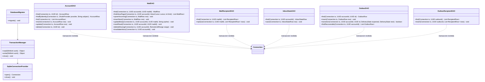

# Persistencia y transacciones finales

**Diseño objetivo del MVP de Evermail en Java 21.** Este documento especifica cómo debe quedar la aplicación; no afirma que el código actual ya lo implemente. Alcance: sesión OAuth2, bandeja, lectura, composición de correos nuevos, envío y caché local. Los demás diagramas de esta carpeta forman el mismo diseño.

```mermaid
classDiagram
    class SqliteConnectionProvider {
        +open() Connection
        +close() void
    }
    class TransactionManager {
        +read(DbWork work) Object
        +write(DbWork work) Object
        +close() void
    }
    class DatabaseMigrator {
        +migrate() void
    }
    class AccountDAO {
        +find(Connection tx, UUID id) AccountRow
        +findByIdentity(Connection tx, OAuthProvider provider, String subject) AccountRow
        +list(Connection tx) List~AccountRow~
        +insert(Connection tx, AccountRow row) void
        +update(Connection tx, AccountRow row) void
        +delete(Connection tx, UUID id) void
    }
    class MailDAO {
        +find(Connection tx, UUID accountId, UUID mailId) MailRow
        +findInboxPage(Connection tx, UUID accountId, InboxCursor cursor, int limit) List~MailRow~
        +upsertIncoming(Connection tx, MailRow row) void
        +insertSent(Connection tx, MailRow row) void
        +updateBody(Connection tx, UUID accountId, UUID mailId, String cipher) void
        +markRead(Connection tx, UUID accountId, UUID mailId) void
        +deleteMissing(Connection tx, UUID accountId, RemoteUidRange range) void
        +invalidateInbox(Connection tx, UUID accountId) void
    }
    class MailRecipientDAO {
        +find(Connection tx, UUID mailId) List~RecipientRow~
        +replace(Connection tx, UUID mailId, List~RecipientRow~ rows) void
    }
    class InboxStateDAO {
        +find(Connection tx, UUID accountId) InboxStateRow
        +save(Connection tx, InboxStateRow row) void
    }
    class OutboxDAO {
        +find(Connection tx, UUID accountId, UUID id) OutboxRow
        +insert(Connection tx, OutboxRow row) void
        +transition(Connection tx, UUID accountId, UUID id, DeliveryState expected, DeliveryState next) boolean
        +findRecoverable(Connection tx, UUID accountId) List~OutboxRow~
    }
    class OutboxRecipientDAO {
        +find(Connection tx, UUID outboxId) List~RecipientRow~
        +insert(Connection tx, UUID outboxId, List~RecipientRow~ rows) void
    }
    TransactionManager --> SqliteConnectionProvider
    DatabaseMigrator --> TransactionManager
    AccountDAO ..> Connection : transaccion recibida
    MailDAO ..> Connection : transaccion recibida
    MailRecipientDAO ..> Connection : transaccion recibida
    InboxStateDAO ..> Connection : transaccion recibida
    OutboxDAO ..> Connection : transaccion recibida
    OutboxRecipientDAO ..> Connection : transaccion recibida
```

## Unidad de trabajo

DbWork<T> es una función que recibe Connection y devuelve T; Object en el dibujo abrevia el retorno genérico T de read/write. Los tipos Row representan exactamente las columnas del [ER](er-diagram.md), sin descifrar tokens o cuerpos. RemoteUidRange contiene UIDVALIDITY, límites del intervalo y UID presentes confirmados por IMAP.

TransactionManager posee una única conexión con acceso serializado; ninguna capa externa la usa simultáneamente. read y write ejecutan bloques cortos; write confirma todo o revierte todo. Los DAO no hacen commit, rollback, close ni cambios de autoCommit. Las operaciones SMTP, IMAP, OAuth2 y keyring se realizan fuera de la transacción.

SqliteConnectionProvider abre la base, activa foreign_keys y un busy_timeout acotado. No existe DB_POOL_SIZE. Los métodos DAO parametrizan valores SQL y comprueban filas afectadas. AccountDAO usa la misma coordinación que los demás.

## Integridad

- Cada consulta de MailRow incluye todos sus campos, también sender_name; no hay lectura de columnas omitidas.
- upsertIncoming usa la clave única de UID del ER y conserva cuerpo y lectura local ya existentes al actualizar metadatos.
- El guardado de una página, sus destinatarios y su cobertura inbox_state comparten transacción.
- insertSent, destinatarios y transición ACCEPTED → RECORDED comparten transacción. outbound_id único hace idempotente repetir esa operación.
- transition usa comparación de estado esperado; solo un trabajador puede cambiar PENDING → SENDING.
- findInboxPage aplica cuenta, direction=INBOX, UIDVALIDITY y remote_uid < beforeUid, ORDER BY remote_uid DESC; sin OFFSET.
- DatabaseMigrator aplica versiones consecutivas antes de habilitar repositorios. Un fallo revierte esa migración y presenta recuperación, no continúa con un esquema parcial. PRAGMA user_version registra la versión.
- Se migran datos legados explícitamente; nunca se ejecuta un borrado general para resolver incompatibilidades.

Los errores SQL se traducen a DatabaseException preservando una causa técnica sin incluir datos sensibles.
