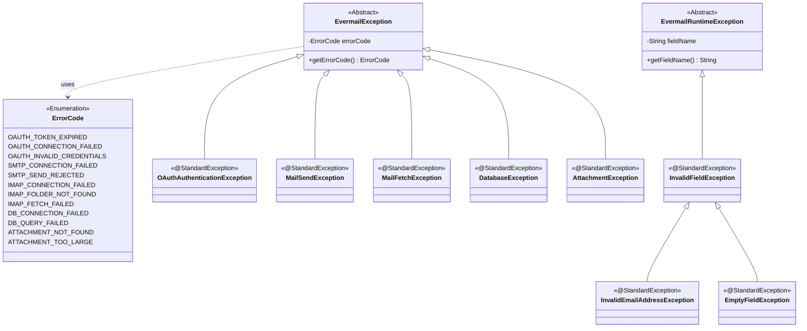

**Design notes:**

1. `EvermailException` extends `Exception` (checked) and `EvermailRuntimeException` extends `RuntimeException` (unchecked) — standard Java classes, not drawn as their own nodes.

2. All leaf classes carry Lombok's `@StandardException` (generates no-arg, message, cause, and message+cause constructors). Since they have an extra field (`errorCode` or `fieldName`), they also need their own constructors that include it.

3. `errorCode` lives in the base class `EvermailException` and is inherited by all checked exceptions (OAuth, sending, receiving, database, attachments).

4. `fieldName` lives in `EvermailRuntimeException`, for the field-validation branch (`InvalidFieldException` and its children). It does not use `ErrorCode` because it is internal business logic, not an external protocol error — it is documented via comments/javadoc in the class.

5. `ErrorCode` is a single, general enum (not one per exception) to keep the code simple, grouping codes by prefix: `OAUTH_`, `SMTP_`, `IMAP_`, `DB_`, `ATTACHMENT_`.

6. Lombok was used as a library to reduce boilerplate (getters, constructors) throughout the whole project, including this package.
