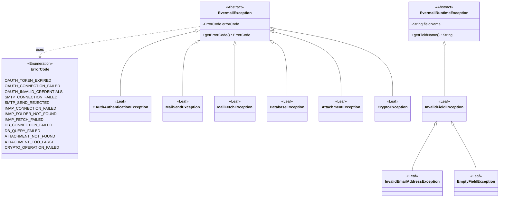

**Design notes:**

1. `EvermailException` extends `Exception` (checked) and `EvermailRuntimeException` extends `RuntimeException` (unchecked) — standard Java classes, not drawn as their own nodes.

2. **All leaf classes declare their own 4 standard constructors manually** (no-arg-equivalent, message, cause, message+cause), each one delegating to the corresponding `super(...)` constructor in their parent class. Lombok's `@StandardException` annotation is **not used** here: it generates constructors that call a parameterless `super()`, which does not exist in `EvermailException` or `EvermailRuntimeException` — both require `errorCode`/`fieldName` as a mandatory first argument on every constructor. Writing these 4 constructors by hand is therefore required for the project to compile, and is reflected in this diagram by the `<<Leaf>>` stereotype instead of `<<@StandardException>>`.

3. `errorCode` lives in the base class `EvermailException` and is inherited by all checked exceptions (OAuth, sending, fetching, database, attachments). Every checked leaf constructor requires an `ErrorCode` as its first parameter.

4. `fieldName` lives in `EvermailRuntimeException`, for the field-validation branch (`InvalidFieldException` and its children). It does not use `ErrorCode` because it represents internal business/validation logic, not an external protocol error — it is documented via comments/javadoc in the class instead.

5. `ErrorCode` is a single, general-purpose enum (not one per exception) to keep the code simple, grouping codes by prefix: `OAUTH_`, `SMTP_`, `IMAP_`, `DB_`, `ATTACHMENT_`, `CRYPTO_`.

5b. **`CryptoException`** covers every failure from `SecurityUtil` — AES-256-GCM encrypt/decrypt failures and OS-native keyring (Windows Credential Manager / macOS Keychain / Linux Secret Service) access failures — under the single `CRYPTO_OPERATION_FAILED` code. It is deliberately **not** reused from `OAuthAuthenticationException` or folded into `DatabaseException`: a local encryption/keyring failure is neither an OAuth handshake problem nor a SQLite problem, and conflating it with either would make a `service` misreact (e.g. treating a keyring failure as "the user's session is invalid" instead of "the local secret store is unavailable").

6. `InvalidEmailAddressException` and `EmptyFieldException` extend `InvalidFieldException` rather than `EvermailRuntimeException` directly — their constructors delegate to `InvalidFieldException`'s constructors, which in turn delegate to `EvermailRuntimeException`'s, so `fieldName` propagates correctly through the full chain.

7. Lombok is still used across this package where compatible (e.g. `@Getter` on `EvermailException`/`EvermailRuntimeException` to generate `getErrorCode()`/`getFieldName()`), reducing boilerplate wherever the constructor requirement does not conflict with `@StandardException`'s assumptions.