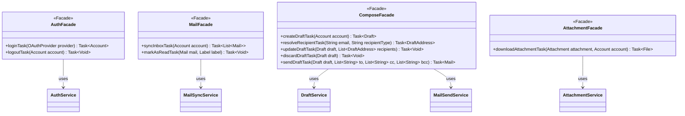

Key syntax used here:
`<<Facade>>`: Stereotype marking classes in the exposure layer toward JavaFX, whose only responsibility is to wrap a synchronous `service` call inside a `Task<T>`.
`-->`: Association/Usage. The Facade holds an injected reference toward the Service(s) it needs.
`-`, `+`: Access modifiers (Private, Public).

Design notes:
1. Every public method returns `Task<T>` (from `javafx.concurrent`) instead of the direct value — the `controller` receives the already-built `Task` (not yet started) and decides when to run it (`new Thread(task).start()` or via a shared `Executor`), keeping the GUI thread free at all times.

2. No method in this package declares checked exceptions nor catches them explicitly: inside the `Task`'s body, any exception thrown by the `service` (`OAuthAuthenticationException`, `MailFetchException`, `DatabaseException`, etc.) is naturally caught by JavaFX's own `Task` mechanism and exposed via `task.getException()` or the `setOnFailed()` callback. That's why no `..>` arrows toward `exception` are drawn in this diagram — the Facade doesn't throw, it only transports.

3. `ComposeFacade` is the only Facade that depends on two Services (`DraftService` and `MailSendService`), reflecting that it groups the entire "mail composition" sub-domain (create, edit, discard, send) under a single facade — the compose screen's `controller` only knows `ComposeFacade`, never the two Services separately.

4. `AttachmentFacade.downloadAttachmentTask()` does not interact with `FileUtil` nor with IMAP directly — it delegates all that complexity to `AttachmentService`, keeping the Facade as a one-line-of-code-per-method layer (build and return the `Task`).

5. Method names always end in `...Task` as an explicit convention, so that from the `controller` itself it is immediately clear which call is asynchronous versus synchronous, without needing to check the full signature.

6. `ComposeFacade` signatures were reconciled with the implemented `service` layer (this diagram originally predated it): `updateDraftTask` takes the recipient list as a separate parameter (wholesale replacement, mirroring `DraftService.updateDraft`), `sendDraftTask` takes raw To/CC/BCC strings (mirroring `MailSendService.sendDraft`), and `resolveRecipientTask` exposes `DraftService.resolveRecipient` so the compose controller can build `DraftAddress` rows from raw email strings without ever touching the service layer directly.