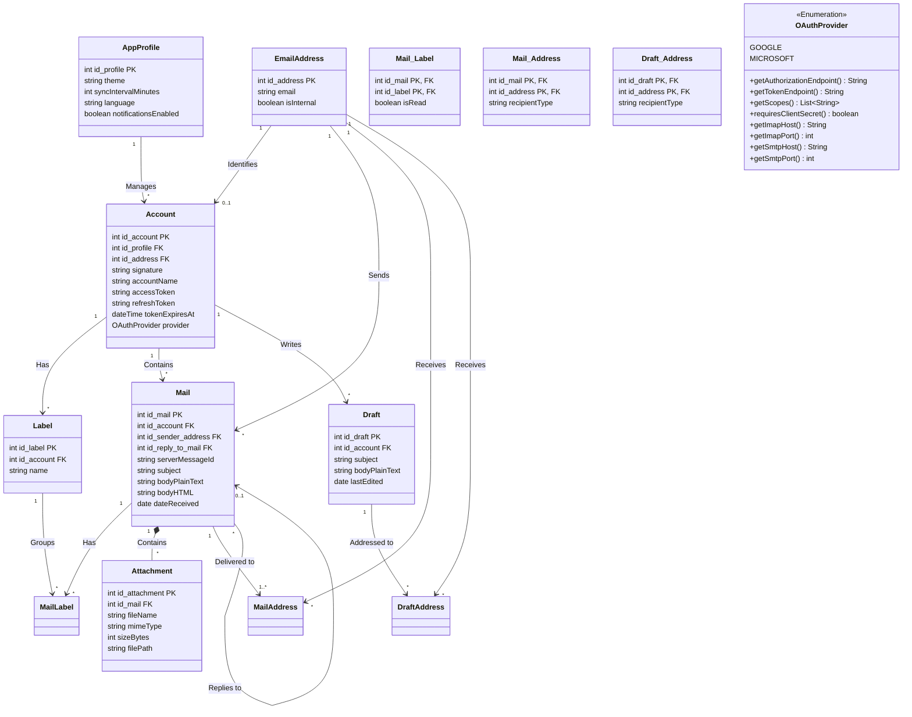

**Key syntax used here:**
- `<<Abstract>>`: Defines an abstract class or interface.
- `<|--`: **Inheritance.** (E.g. A Customer _is a_ User).
- `*--`: **Composition.** Life-or-death relationship (e.g. an _OrderItem_ makes no sense without its _Order_).
- `o--`: **Aggregation.** Relationship where the objects are independent (e.g. a _Product_ still exists in the store even if the _OrderItem_ is deleted).
- `-->`: **Simple association.**
- `-`, `+`, `#`: Access modifiers (Private, Public, Protected).
