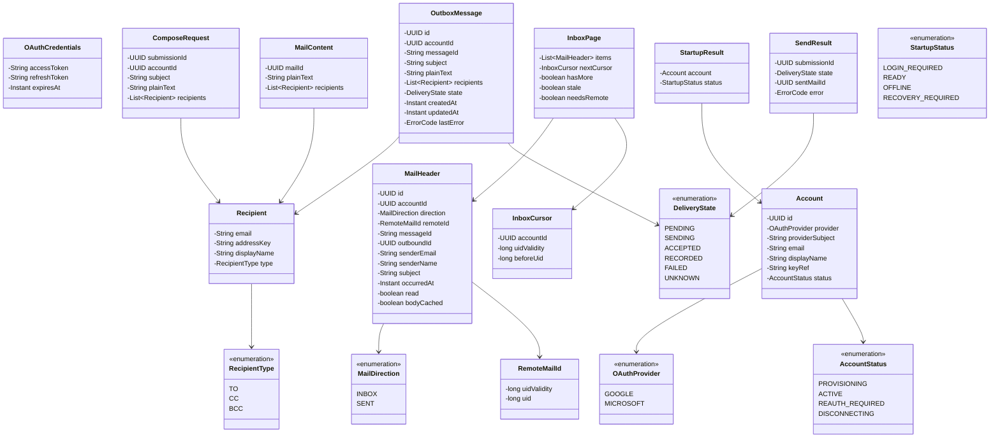

# Modelo de dominio final

**Diseño objetivo del MVP de Evermail en Java 21.** Este documento especifica cómo debe quedar la aplicación; no afirma que el código actual ya lo implemente. Alcance: sesión OAuth2, bandeja, lectura, composición de correos nuevos, envío y caché local. Los demás diagramas de esta carpeta forman el mismo diseño.

```mermaid
classDiagram
    class Account {
        -UUID id
        -OAuthProvider provider
        -String providerSubject
        -String email
        -String displayName
        -String keyRef
        -AccountStatus status
    }
    class OAuthCredentials {
        -String accessToken
        -String refreshToken
        -Instant expiresAt
    }
    class MailHeader {
        -UUID id
        -UUID accountId
        -MailDirection direction
        -RemoteMailId remoteId
        -String messageId
        -UUID outboundId
        -String senderEmail
        -String senderName
        -String subject
        -Instant occurredAt
        -boolean read
        -boolean bodyCached
    }
    class RemoteMailId {
        -long uidValidity
        -long uid
    }
    class MailContent {
        -UUID mailId
        -String plainText
        -List~Recipient~ recipients
    }
    class Recipient {
        -String email
        -String addressKey
        -String displayName
        -RecipientType type
    }
    class ComposeRequest {
        -UUID submissionId
        -UUID accountId
        -String subject
        -String plainText
        -List~Recipient~ recipients
    }
    class OutboxMessage {
        -UUID id
        -UUID accountId
        -String messageId
        -String subject
        -String plainText
        -List~Recipient~ recipients
        -DeliveryState state
        -Instant createdAt
        -Instant updatedAt
        -ErrorCode lastError
    }
    class InboxCursor {
        -UUID accountId
        -long uidValidity
        -long beforeUid
    }
    class InboxPage {
        -List~MailHeader~ items
        -InboxCursor nextCursor
        -boolean hasMore
        -boolean stale
        -boolean needsRemote
    }
    class SendResult {
        -UUID submissionId
        -DeliveryState state
        -UUID sentMailId
        -ErrorCode error
    }
    class StartupResult {
        -Account account
        -StartupStatus status
    }
    class OAuthProvider {
        <<enumeration>>
        GOOGLE
        MICROSOFT
    }
    class AccountStatus {
        <<enumeration>>
        PROVISIONING
        ACTIVE
        REAUTH_REQUIRED
        DISCONNECTING
    }
    class MailDirection {
        <<enumeration>>
        INBOX
        SENT
    }
    class RecipientType {
        <<enumeration>>
        TO
        CC
        BCC
    }
    class DeliveryState {
        <<enumeration>>
        PENDING
        SENDING
        ACCEPTED
        RECORDED
        FAILED
        UNKNOWN
    }
    class StartupStatus {
        <<enumeration>>
        LOGIN_REQUIRED
        READY
        OFFLINE
        RECOVERY_REQUIRED
    }
    Account --> OAuthProvider
    Account --> AccountStatus
    MailHeader --> MailDirection
    MailHeader --> RemoteMailId
    Recipient --> RecipientType
    ComposeRequest --> Recipient
    OutboxMessage --> Recipient
    OutboxMessage --> DeliveryState
    InboxPage --> MailHeader
    InboxPage --> InboxCursor
    MailContent --> Recipient
    SendResult --> DeliveryState
    StartupResult --> Account
```

## Contratos

Los modelos son inmutables; cualquier transición genera una nueva instancia. Los objetos de dominio contienen texto descifrado únicamente cuando se necesita. OAuthCredentials nunca llega a los controladores y sus valores no aparecen en toString, logs ni errores.

RemoteMailId es opcional para SENT y obligatorio para INBOX. InboxCursor es opaco para la interfaz: no puede trasladarse entre cuentas ni entre generaciones UIDVALIDITY. nextCursor es NULL cuando no hay siguiente página conocida; needsRemote distingue caché incompleta de fin de buzón.

ComposeRequest.submissionId se genera una vez por acción de envío y se conserva al repetir la misma petición. Una petición con ese ID y distinto contenido es inválida. RECORDED referencia sentMailId; otros resultados pueden no tenerlo.

MailContent expone solo texto legible. MimeUtil convierte HTML cuando no hay texto plano, sin ejecutar HTML ni cargar recursos externos. No se modela descarga de adjuntos en el MVP.

La correspondencia física está en el [ER](er-diagram.md). Los DAO utilizan filas de persistencia separadas (AccountRow, MailRow, OutboxRow e InboxStateRow) con campos cifrados tal como figuran allí; no mutan estos modelos para cifrarlos.
