```mermaid
classDiagram
    class AccountRepository {
        <<Repository>>
        +getById(int idAccount) Account
        +getAll() List~Account~
        +save(Account account) void
        +delete(int idAccount) void
    }

    class MailRepository {
        <<Repository>>
        +getById(int idMail) Mail
        +getInbox(Account account, int limit) List~Mail~
        +save(Mail mail) void
        +markAsRead(int idMail, int idLabel, boolean isRead) void
        +delete(int idMail) void
    }

    class DraftRepository {
        <<Repository>>
        +getById(int idDraft) Draft
        +getByAccount(Account account) List~Draft~
        +save(Draft draft) void
        +delete(int idDraft) void
    }

    class LabelRepository {
        <<Repository>>
        +getById(int idLabel) Label
        +getByAccount(Account account) List~Label~
        +getUnreadCount(int idLabel) int
        +save(Label label) void
        +delete(int idLabel) void
    }

    %% AccountRepository combines
    AccountRepository --> AccountDAO : uses
    AccountRepository --> AppProfileDAO : uses
    AccountRepository --> EmailAddressDAO : uses

    %% MailRepository combines
    MailRepository --> MailDAO : uses
    MailRepository --> MailLabelDAO : uses
    MailRepository --> MailAddressDAO : uses
    MailRepository --> AttachmentDAO : uses
    MailRepository --> EmailAddressDAO : uses

    %% DraftRepository combines
    DraftRepository --> DraftDAO : uses
    DraftRepository --> DraftAddressDAO : uses
    DraftRepository --> EmailAddressDAO : uses

    %% LabelRepository combines
    LabelRepository --> LabelDAO : uses
    LabelRepository --> MailLabelDAO : uses

    %% Dependencies toward exception (throws)
    AccountRepository ..> DatabaseException : throws
    MailRepository ..> DatabaseException : throws
    DraftRepository ..> DatabaseException : throws
    LabelRepository ..> DatabaseException : throws
```

**Key syntax used here:**
- `<<Repository>>`: Stereotype marking domain-aggregate classes, which combine one or more DAOs to expose a coherent view of a main entity.
- `-->`: **Association/Usage.** The Repository holds an injected reference toward each DAO it needs.
- `..>`: **Dependency.** The Repository propagates the referenced exception (originating in the DAO) up to the `service` layer.
- `-`, `+`: Access modifiers (Private, Public).

**Design notes:**

1. Each Repository exposes only domain vocabulary (`getInbox`, `markAsRead`, `getUnreadCount`) instead of SQL vocabulary (`findByX`, `insertBatch`) — the `service` layer never knows that underneath there are several tables or SQL statements involved.

2. `MailRepository.save(Mail mail)` is the clearest example of orchestration: when saving a complete mail, it internally invokes `MailDAO.insert()`, `MailAddressDAO.insertBatch()` (recipients), and `AttachmentDAO.insert()` (if applicable) in a single atomic operation, resolving in one method what at the DAO layer are three separate calls.

3. `EmailAddressDAO` has no Repository of its own (as already defined): it is injected and consumed directly by `AccountRepository`, `MailRepository`, and `DraftRepository`, each resolving email addresses in the context of its own aggregate.

4. `LabelRepository.getUnreadCount()` is a convenience method that aggregates over `MailLabelDAO` (counting rows with `isRead = false` for a given label) — it lives here and not in `MailLabelDAO` because "counting unread items" is a business need (showing a badge in the UI), not a pure CRUD operation.

5. All Repositories propagate `DatabaseException` without transforming it — the `service` that consumes them (`MailSyncService`, `MailSendService`, `DraftService`, `AccountRepository` via `AuthService`, etc.) decides how to handle it, preserving the same `ErrorCode` originating from the DAO.

6. No Repository is aware of `SqliteConnectionProvider` directly — that dependency lives only in the DAOs (see `Diagrama_UML_DAO.md`), reinforcing that the Repository only orchestrates DAOs, it does not manage connections.
