```mermaid
classDiagram
    class AccountRepository {
        <<Repository>>
        +getById(int idAccount) Account
        +getAll() List~Account~
        +create(Account account, AppProfile profile, EmailAddress emailAddress) Account
        +save(Account account) void
        +delete(int idAccount) void
        +getEmailOfAccount(Account account) String
        +resolveOrCreateAddress(String email, boolean isInternal) EmailAddress
    }

    class MailRepository {
        <<Repository>>
        +getById(int idMail) Mail
        +getInbox(Account account, int limit) List~Mail~
        +save(Mail mail) void
        +markAsRead(int idMail, int idLabel, boolean isRead) void
        +delete(int idMail) void
        +updateAttachmentPath(Attachment attachment) void
    }

    class DraftRepository {
        <<Repository>>
        +getById(int idDraft) Draft
        +getByAccount(Account account) List~Draft~
        +save(Draft draft) void
        +delete(int idDraft) void
    }

    class LabelRepository {
        <<Repository>>
        +getById(int idLabel) Label
        +getByAccount(Account account) List~Label~
        +getUnreadCount(int idLabel) int
        +save(Label label) void
        +delete(int idLabel) void
    }

%% AccountRepository combines
    AccountRepository --> AccountDAO : uses
    AccountRepository --> AppProfileDAO : uses
    AccountRepository --> EmailAddressDAO : uses

%% MailRepository combines
    MailRepository --> MailDAO : uses
    MailRepository --> MailLabelDAO : uses
    MailRepository --> MailAddressDAO : uses
    MailRepository --> AttachmentDAO : uses
    MailRepository --> EmailAddressDAO : uses

%% DraftRepository combines
    DraftRepository --> DraftDAO : uses
    DraftRepository --> DraftAddressDAO : uses
    DraftRepository --> EmailAddressDAO : uses

%% LabelRepository combines
    LabelRepository --> LabelDAO : uses
    LabelRepository --> MailLabelDAO : uses

%% Dependencies towards util (SecretKey resolution)
    AccountRepository --> SecurityUtil : uses
    MailRepository --> SecurityUtil : uses
    DraftRepository --> SecurityUtil : uses

%% Dependencies towards exception (throws)
    AccountRepository ..> DatabaseException : throws
    MailRepository ..> DatabaseException : throws
    DraftRepository ..> DatabaseException : throws
    LabelRepository ..> DatabaseException : throws
    AccountRepository ..> CryptoException : throws
    MailRepository ..> CryptoException : throws
    DraftRepository ..> CryptoException : throws
```

**Key syntax used here:**
- `<<Repository>>`: Stereotype marking domain-aggregate classes that combine one or more DAOs to expose a coherent view of a primary entity.
- `-->`: **Association/Usage.** The Repository holds an injected reference to each DAO (or util class) it needs.
- `..>`: **Dependency.** The Repository propagates the referenced exception (originated in the DAO) up to the `service` layer.
- `-`, `+`: Access modifiers (Private, Public).

**Design notes:**

1. Each Repository exposes only domain vocabulary (`getInbox`, `markAsRead`, `getUnreadCount`) instead of SQL vocabulary (`findByX`, `insertBatch`) — `service` never knows that underneath there are several tables, SQL statements, or encryption-key resolution involved.

2. **`MailRepository` and `DraftRepository` depend on `SecurityUtil`** to resolve the `SecretKey` via `SecurityUtil.retrieveAesKey(idAccount)` **once per business operation**, then call `SecurityUtil.encrypt()`/`decrypt()` themselves around the plain-text fields before/after delegating to their DAOs — the DAOs (per `uml-dao.md`, note 4) never see the key or the unencrypted value. `MailRepository.save(Mail mail)` resolves the key once and uses it to encrypt `bodyPlainText`/`bodyHTML` before calling `MailDAO.insert()`; that same resolved key is **not** passed to `AttachmentDAO`, since attachment file content is encrypted separately in the `service` layer (`AttachmentService` + `FileUtil.downloadAttachment()`), not through `MailRepository`/`AttachmentDAO` — `AttachmentDAO` only ever receives plain metadata (`fileName`, `mimeType`, `sizeBytes`, `filePath`).

3. **`AccountRepository` also depends on `SecurityUtil`**, since it orchestrates the full account-creation security flow via its dedicated `create()` method: `SecurityUtil.generateAesKey()` → encrypt `accessToken`/`refreshToken` → `AccountDAO.insert()` (returns `idAccount`) → `SecurityUtil.storeAesKey(idAccount, key)` in the OS keyring. That key is **stable for the lifetime of the account** — it is generated exactly once at `create()` time and never rotated automatically; `save()` (used for subsequent updates, e.g. an OAuth token refresh) always re-resolves the *same* key via `retrieveAesKey()` rather than generating a new one, because that same key also protects every `Mail`/`Draft` body belonging to the account (see note 2) — rotating it on every token refresh would make previously-synced mail content undecryptable. `LabelRepository` remains the only Repository without a `SecurityUtil` dependency, since none of its combined DAOs (`LabelDAO`, `MailLabelDAO`) handle encrypted fields.

3b. `AccountRepository.create()` also resolves `AppProfile` and `EmailAddress` before touching `AccountDAO`, since `account.id_profile`/`account.id_address` are `NOT NULL` foreign keys in the schema and must exist first: if the given `AppProfile` has no `idProfile` yet, it is inserted via `AppProfileDAO`; the given `EmailAddress` is looked up by `EmailAddressDAO.findByEmail()` first (to reuse an existing row, since `email` is `UNIQUE`) and only inserted if not found. `AccountRepository.save()`, by contrast, is update-only — it assumes `idAccount`, `idProfile`, and `idAddress` are already resolved, and exists as a separate method rather than an overload of `create()` so each method's contract stays unambiguous.

4. `MailRepository.save(Mail mail)` remains the clearest example of orchestration: when saving a complete mail, it internally invokes `MailDAO.insert()` (with the body fields already encrypted) and `MailAddressDAO.insertBatch()` (recipients) as a single atomic operation — resolving in one method what at the DAO layer are two separate calls, sharing one already-resolved `SecretKey` for the encryption step. `AttachmentDAO.insert()` is invoked afterward, if applicable, but independently of that key.

5. `EmailAddressDAO` has no Repository of its own (as already defined): it is injected and consumed directly from `AccountRepository`, `MailRepository`, and `DraftRepository`, each resolving email addresses in the context of its own aggregate.

6. `LabelRepository.getUnreadCount()` is a convenience method that aggregates over `MailLabelDAO` (counting rows with `isRead = false` for a given label) — it lives here and not in `MailLabelDAO` because "counting unread" is a business need (showing a badge in the UI), not a pure CRUD operation.

7. All Repositories propagate `DatabaseException` without transforming it — the `service` that consumes them (`MailSyncService`, `MailSendService`, `DraftService`, `AccountRepository` via `AuthService`, etc.) decides how to handle it, keeping the same `ErrorCode` originated in the DAO. **Correction:** any failure raised by `SecurityUtil` (key generation, keyring access, AES encrypt/decrypt) is **not** translated into a `DatabaseException` — `SecurityUtil` throws its own checked `CryptoException` (`ErrorCode.CRYPTO_OPERATION_FAILED`), kept deliberately separate so a `service` can tell apart "the database failed" from "the local encryption/keyring failed" without inspecting `ErrorCode`. `AccountRepository`, `MailRepository`, and `DraftRepository` therefore each propagate **both** `DatabaseException` and `CryptoException`, undisturbed, up to `service`.

8. No Repository is aware of `SqliteConnectionProvider` directly — that dependency lives only in the DAOs (see `uml-dao.md`), reinforcing that the Repository only orchestrates DAOs and encryption-key resolution, it does not manage connections.

9. `AccountRepository.getEmailOfAccount()` resolves the account's own email (normalized in `email_address`, linked via `id_address`) — needed by `MailSessionProvider` because XOAUTH2 authenticates with the email, not just the access token. `resolveOrCreateAddress()` centralizes the "findByEmail or insert" pattern (previously inline in `create()`) and is reused by `MailSyncService`/`MailSendService`/`DraftService` to build junction rows from raw email strings. `MailRepository.updateAttachmentPath()` delegates to the pre-existing `AttachmentDAO.updateFilePath()` and persists the on-disk path of a downloaded attachment so later opens skip the network.