```mermaid
classDiagram
    class AccountRepository {
        <<Repository>>
        +getById(int idAccount) Account
        +getAll() List~Account~
        +save(Account account) void
        +delete(int idAccount) void
    }

    class MailRepository {
        <<Repository>>
        +getById(int idMail) Mail
        +getInbox(Account account, int limit) List~Mail~
        +save(Mail mail) void
        +markAsRead(int idMail, int idLabel, boolean isRead) void
        +delete(int idMail) void
    }

    class DraftRepository {
        <<Repository>>
        +getById(int idDraft) Draft
        +getByAccount(Account account) List~Draft~
        +save(Draft draft) void
        +delete(int idDraft) void
    }

    class LabelRepository {
        <<Repository>>
        +getById(int idLabel) Label
        +getByAccount(Account account) List~Label~
        +getUnreadCount(int idLabel) int
        +save(Label label) void
        +delete(int idLabel) void
    }

    %% AccountRepository combines
    AccountRepository --> AccountDAO : uses
    AccountRepository --> AppProfileDAO : uses
    AccountRepository --> EmailAddressDAO : uses

    %% MailRepository combines
    MailRepository --> MailDAO : uses
    MailRepository --> MailLabelDAO : uses
    MailRepository --> MailAddressDAO : uses
    MailRepository --> AttachmentDAO : uses
    MailRepository --> EmailAddressDAO : uses

    %% DraftRepository combines
    DraftRepository --> DraftDAO : uses
    DraftRepository --> DraftAddressDAO : uses
    DraftRepository --> EmailAddressDAO : uses

    %% LabelRepository combines
    LabelRepository --> LabelDAO : uses
    LabelRepository --> MailLabelDAO : uses

    %% Dependencies towards util (SecretKey resolution)
    MailRepository --> SecurityUtil : uses
    DraftRepository --> SecurityUtil : uses

    %% Dependencies towards exception (throws)
    AccountRepository ..> DatabaseException : throws
    MailRepository ..> DatabaseException : throws
    DraftRepository ..> DatabaseException : throws
    LabelRepository ..> DatabaseException : throws
```

**Key syntax used here:**
- `<<Repository>>`: Stereotype marking domain-aggregate classes that combine one or more DAOs to expose a coherent view of a primary entity.
- `-->`: **Association/Usage.** The Repository holds an injected reference to each DAO (or util class) it needs.
- `..>`: **Dependency.** The Repository propagates the referenced exception (originated in the DAO) up to the `service` layer.
- `-`, `+`: Access modifiers (Private, Public).

**Design notes:**

1. Each Repository exposes only domain vocabulary (`getInbox`, `markAsRead`, `getUnreadCount`) instead of SQL vocabulary (`findByX`, `insertBatch`) — `service` never knows that underneath there are several tables, SQL statements, or encryption-key resolution involved.

2. **`MailRepository` and `DraftRepository` now depend directly on `SecurityUtil`** (from the `util` package), since they are the ones responsible for resolving the `SecretKey` via `SecurityUtil.retrieveAesKey(idAccount)` **once per business operation** and distributing that same key to the DAOs they orchestrate internally. Example: `MailRepository.save(Mail mail)` resolves the key once and passes it to both `MailDAO.insert()` and `AttachmentDAO.insert()` — a single keyring access instead of two.

3. `AccountRepository` and `LabelRepository` do not need `SecurityUtil` because none of their combined DAOs (`AccountDAO`, `AppProfileDAO`, `EmailAddressDAO`, `LabelDAO`, `MailLabelDAO`) handle encrypted fields.

4. `MailRepository.save(Mail mail)` remains the clearest example of orchestration: when saving a complete mail, it internally invokes `MailDAO.insert()`, `MailAddressDAO.insertBatch()` (recipients), and `AttachmentDAO.insert()` (if applicable) as a single atomic operation — resolving in one method what at the DAO layer are three separate calls, now sharing one already-resolved `SecretKey`.

5. `EmailAddressDAO` has no Repository of its own (as already defined): it is injected and consumed directly from `AccountRepository`, `MailRepository`, and `DraftRepository`, each resolving email addresses in the context of its own aggregate.

6. `LabelRepository.getUnreadCount()` is a convenience method that aggregates over `MailLabelDAO` (counting rows with `isRead = false` for a given label) — it lives here and not in `MailLabelDAO` because "counting unread" is a business need (showing a badge in the UI), not a pure CRUD operation.

7. All Repositories propagate `DatabaseException` without transforming it — the `service` that consumes them (`MailSyncService`, `MailSendService`, `DraftService`, `AccountRepository` via `AuthService`, etc.) decides how to handle it, keeping the same `ErrorCode` originated in the DAO.

8. No Repository is aware of `SqliteConnectionProvider` directly — that dependency lives only in the DAOs (see `uml-dao.md`), reinforcing that the Repository only orchestrates DAOs and encryption-key resolution, it does not manage connections.