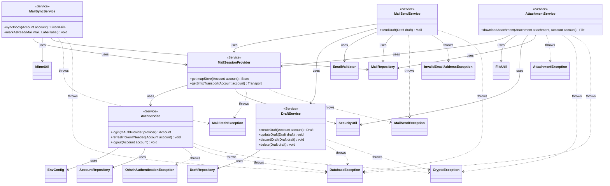

**Key syntax used here:**
- `<<Service>>`: Stereotype marking classes in the business logic layer, protocol-aware but with no knowledge of JavaFX.
- `-->`: **Association/Usage.** The source class holds a reference (constructor-injected) toward the referenced class and invokes it directly.
- `..>`: **Dependency.** The source class throws the referenced exception, without containing it nor inheriting from it.
- `-`, `+`: Access modifiers (Private, Public).

**Design notes:**

1. `MailSessionProvider` centralizes the creation of all authenticated Jakarta Mail sessions (IMAP `Store` and SMTP `Transport`) using XOAUTH2. Before opening any connection, it delegates to `AuthService.refreshTokenIfNeeded()` to guarantee a valid token — avoiding duplication of that logic across `MailSyncService`, `MailSendService`, and `AttachmentService`.

2. `MailSendService.sendDraft()` concentrates the entire "send = delete Draft + create Mail with the Sent label" business rule documented in the E-R model. Internally it validates the recipient address (`EmailValidator`), sends via SMTP (through `MailSessionProvider`), and only if the send succeeds does it invoke `DraftService.delete()` followed by the creation of the corresponding `Mail` — preventing the `facade` from having to coordinate two services and risk an inconsistent state if the send partially fails.

3. `DraftService` keeps an internal `delete()` method in addition to `discardDraft()`: both delete the Draft without leaving a trace, but `discardDraft()` is the operation triggered by the user (the "Discard" button), while `delete()` is invoked only by `MailSendService` as part of the successful send flow. They are documented as separate methods to keep each call's intent explicit, even though they share the same deletion implementation.

4. No class in this package is aware of JavaFX's `Task<T>` nor handles threading: all methods are synchronous and blocking. That asynchrony responsibility is fully delegated to the `facade` package, which wraps every call to `service` inside a `Task<T>`.

5. `MailSyncService.markAsRead()` operates on the pair `(Mail, Label)`, reflecting the design already defined in the E-R model, where `isRead` lives in `Mail_Label` — meaning a mail can be read under one label and unread under another (Gmail-style behavior).

6. Each Service depends on exactly the Repository that corresponds to its domain aggregate: `AuthService` and `MailSyncService`/`MailSendService` use `AccountRepository`/`MailRepository` respectively to persist tokens and mail; `DraftService` uses `DraftRepository`; `AttachmentService` uses `MailRepository` to resolve `Attachment` metadata and to persist the downloaded file's path (`MailRepository.updateAttachmentPath()`, see `uml-repositories.md` note 9). No Service knows a DAO directly, nor `SqliteConnectionProvider` — that layer stays completely hidden behind the corresponding Repository.

7. Since every Repository propagates `DatabaseException` without transforming it (see `uml-repositories.md`, note 7), every Service that depends on one also declares `DatabaseException` among its possible thrown exceptions, in addition to its own domain-specific ones (`OAuthAuthenticationException`, `MailSendException`, etc.).

8. **`AttachmentService` now depends directly on `SecurityUtil`**, in addition to `FileUtil`. Before calling `FileUtil.downloadAttachment()`, `AttachmentService` must resolve the account's `SecretKey` via `SecurityUtil.retrieveAesKey(idAccount)` — `FileUtil` cannot resolve it on its own (it's fully static, with no keyring access) and `MailRepository` isn't asked to do it here, since resolving the key for a *file download* is a `service`-level concern about *when* to decrypt, not a `repository`-level concern about *how* to store `Mail`/`Draft` rows.

9. **`AuthService` and `DraftService` now also declare `CryptoException`**, alongside `DatabaseException`, since both depend on Repositories (`AccountRepository`, `DraftRepository`) that internally call `SecurityUtil` and propagate its exceptions unchanged (see `uml-repositories.md`, note 8).