```mermaid
classDiagram
    class AuthService {
    <<Service>>
        -AccountRepository accountRepository
        -EnvConfig envConfig
        -SecurityUtil securityUtil
        -HttpClient httpClient
        +AuthService(AccountRepository accountRepository, EnvConfig envConfig, SecurityUtil securityUtil)
        +login(OAuthProvider provider) Account
        +refreshTokenIfNeeded(Account account) void
        +logout(Account account) void
    }
    class MailSessionProvider {
        <<Service>>
        +getImapStore(Account account) Store
        +getSmtpTransport(Account account) Transport
        +createSmtpSession() Session
    }
    class MailSyncService {
        <<Service>>
        +syncInbox(Account account) List~Mail~
        +markAsRead(Mail mail, Label label) void
    }
    class MailSendService {
        <<Service>>
        +sendDraft(Draft draft, List~String~ to, List~String~ cc, List~String~ bcc) Mail
    }
    class DraftService {
        <<Service>>
        +createDraft(Account account) Draft
        +updateDraft(Draft draft, List~DraftAddress~ recipients) void
        +resolveRecipient(String email, String recipientType) DraftAddress
        +discardDraft(Draft draft) void
        +delete(Draft draft) void
    }
    class AttachmentService {
        <<Service>>
        +downloadAttachment(Attachment attachment, Account account) File
    }
    %% Collaboration between services (constructor injection)
    MailSessionProvider --> AuthService : uses
    MailSyncService --> MailSessionProvider : uses
    MailSendService --> MailSessionProvider : uses
    MailSendService --> DraftService : uses
    AttachmentService --> MailSessionProvider : uses
    %% Dependencies toward model
    AuthService --> OAuthProvider : uses
    %% Dependencies toward util
    AuthService --> SecurityUtil : uses
    MailSyncService --> MimeUtil : uses
    MailSendService --> EmailValidator : uses
    AttachmentService --> FileUtil : uses
    AttachmentService --> SecurityUtil : uses
    %% Dependencies toward config
    AuthService --> EnvConfig : uses
    %% Dependencies toward repository
    AuthService --> AccountRepository : uses
    MailSessionProvider --> AccountRepository : uses
    MailSyncService --> MailRepository : uses
    MailSyncService --> AccountRepository : uses
    MailSendService --> MailRepository : uses
    MailSendService --> AccountRepository : uses
    DraftService --> DraftRepository : uses
    DraftService --> AccountRepository : uses
    AttachmentService --> MailRepository : uses
    %% Dependencies toward exception (throws)
    AuthService ..> OAuthAuthenticationException : throws
    MailSessionProvider ..> MailFetchException : throws
    MailSessionProvider ..> MailSendException : throws
    MailSyncService ..> MailFetchException : throws
    MailSyncService ..> CryptoException : throws
    MailSendService ..> MailSendException : throws
    MailSendService ..> InvalidEmailAddressException : throws
    MailSendService ..> CryptoException : throws
    AttachmentService ..> AttachmentException : throws
    AttachmentService ..> CryptoException : throws
    AuthService ..> DatabaseException : throws
    AuthService ..> CryptoException : throws
    MailSyncService ..> DatabaseException : throws
    MailSendService ..> DatabaseException : throws
    DraftService ..> DatabaseException : throws
    DraftService ..> CryptoException : throws
    AttachmentService ..> DatabaseException : throws
```

Key syntax used here:
`<<Service>>`: Stereotype marking classes in the business logic layer, protocol-aware but with no knowledge of JavaFX.
`-->`: Association/Usage. The source class holds a reference (constructor-injected) toward the referenced class and invokes it directly.
`..>`: Dependency. The source class throws the referenced exception, without containing it nor inheriting from it.
`-`, `+`: Access modifiers (Private, Public).

Design notes:
1. `OAuthProvider` is an enumeration that lives in the `model` package (drawn in `uml-model.md`; shown here only as the type `AuthService` consumes). Each constant centralizes its provider's configuration — authorization endpoint, token endpoint, OAuth scopes, whether the token request must include `client_secret`, and the IMAP/SMTP hosts/ports — so that both `AuthService` and `MailSessionProvider` are single algorithms parameterized by provider. Google sends `client_secret`; Microsoft is registered as a public client (PKCE-only) and does not.

2. `AuthService.login()` implements the OAuth 2.0 Authorization Code flow with PKCE **manually**, using JDK classes only — no external OAuth SDK: `java.net.http.HttpClient` (held as a private field, built once in the constructor) for the POST calls to the provider's `/token` endpoint; `Desktop.browse(URI)` to open the authorization URL in the system browser; `com.sun.net.httpserver.HttpServer` on an ephemeral loopback port (`http://127.0.0.1:{port}/callback`) to capture the redirect; `MessageDigest` + `SecureRandom` for the PKCE `code_verifier`/`code_challenge`; and Gson to parse the JSON token response and the `id_token` claims (email/name). The system browser + loopback redirect is the only viable presentation: Google blocks OAuth inside embedded WebViews by policy and RFC 8252 recommends an external user agent for native apps. `AuthService` does **not** encrypt anything: it hands plain-text tokens to `AccountRepository.create()`, which owns the encryption orchestration (the old §5.3 sequence showing AuthService encrypting is superseded by this note).

3. `AuthService` receives `AccountRepository`, `EnvConfig` and `SecurityUtil` via constructor injection. `SecurityUtil` is used only for `isTokenExpired()` inside `refreshTokenIfNeeded()` — keeping expiration logic centralized; token decryption is never done here because accounts always arrive already decrypted from `AccountRepository`.

4. `MailSessionProvider` centralizes the creation of all authenticated Jakarta Mail sessions (IMAP `Store` and SMTP `Transport`) using XOAUTH2. Before opening any connection it delegates to `AuthService.refreshTokenIfNeeded()` to guarantee a valid token. It depends on `AccountRepository` solely to resolve the account's own email (`getEmailOfAccount`), because XOAUTH2 requires the user's email — not just the access token — to authenticate. It does **not** depend on `SecurityUtil`: the account's tokens arrive decrypted from the repository. `createSmtpSession()` centralizes the SMTP `Session` configuration (XOAUTH2 + STARTTLS) so `MailSendService` can build its `MimeMessage` against the same configuration the `Transport` uses (`Service.getSession()` is package-private in Jakarta Mail and cannot be called from outside).

5. `MailSendService.sendDraft()` concentrates the entire "send = delete Draft + create Mail" business rule documented in the E-R model. Recipients travel as raw email strings (To/CC/BCC) because neither `Draft` nor `Mail` carry recipient lists as fields — the compose screen submits exactly what the user typed. Every address is validated (`EmailValidator`), resolved to its `email_address` row via `AccountRepository.resolveOrCreateAddress`, sent via SMTP (through `MailSessionProvider`), and only if the send succeeds does it invoke `DraftService.delete()` followed by `MailRepository.save()` of the sent Mail — preventing the `facade` from coordinating two services and risking an inconsistent state on a partial failure.

6. `DraftService` keeps an internal `delete()` method in addition to `discardDraft()`: both delete the Draft without leaving a trace, but `discardDraft()` is the user-triggered "Discard" action, while `delete()` is invoked only by `MailSendService` after a successful send. `createDraft()` returns an in-memory Draft (nothing persisted); the first `updateDraft()` inserts it, since `DraftRepository.save` decides insert vs. update by `idDraft == null` — an empty compose window never leaves a ghost row. `updateDraft` takes the recipient list as a separate parameter (wholesale replacement), and `resolveRecipient()` turns a raw email string into a `DraftAddress` ready to save.

7. `MailSyncService.syncInbox()` fetches the most recent mails from the remote INBOX and persists only those whose Message-ID is not already in the local cache (dedup by `server_message_id`), returning the refreshed local inbox. The sender is resolved via `AccountRepository.resolveOrCreateAddress` (external), the account itself is recorded as the sole recipient, and attachment **metadata only** is persisted (binaries stay on the server until the user downloads them via `AttachmentService`). `markAsRead()` operates on the pair `(Mail, Label)`, reflecting the E-R model where `isRead` lives in `Mail_Label` — a mail can be read under one label and unread under another.

8. `AttachmentService.downloadAttachment()` re-locates the raw MIME part on IMAP (the store/folder stays open until the stream is consumed) and hands the stream to `FileUtil.downloadAttachment(accountId, fileName, remoteStream, key, securityUtil)` — **FileUtil owns the encryption-at-rest and the disk write** for attachments; `AttachmentService` only resolves the `SecretKey` via `SecurityUtil.retrieveAesKey` and, once the file exists, persists its path via `MailRepository.updateAttachmentPath()` so subsequent opens are local-only.
No class in this package is aware of JavaFX's `Task<T>` nor handles threading: all methods are synchronous and blocking. That asynchrony responsibility is fully delegated to the `facade` package, which wraps every call to `service` inside a `Task<T>`.
Each Service depends on exactly the Repository that corresponds to its domain aggregate, plus `AccountRepository` wherever an email-address resolution is needed (`MailSessionProvider`, `MailSyncService`, `MailSendService`, `DraftService`) — services never touch DAOs nor `SqliteConnectionProvider`.
Since every Repository propagates `DatabaseException` and `CryptoException` without transforming them (see `uml-repositories.md`, notes 7–8), every Service that depends on one also declares both among its possible thrown exceptions, in addition to its own domain-specific ones (`OAuthAuthenticationException`, `MailSendException`, `MailFetchException`, `AttachmentException`).