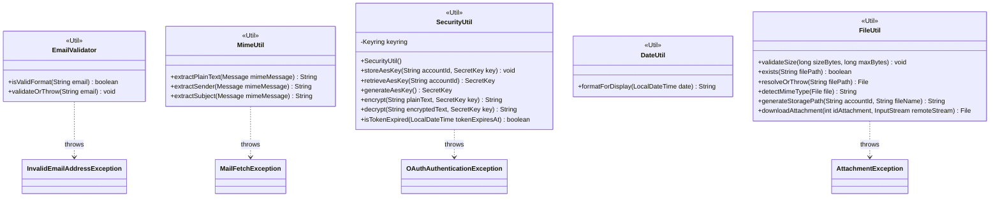

**Key syntax used here:**
- `<<Util>>`: Stereotype marking utility classes with no domain identity of their own (neither entities nor exceptions).
- `..>`: **Dependency.** The source class uses/throws the referenced class, but does not contain it nor inherit from it.
- `-`, `+`: Access modifiers (Private, Public).

**Design notes:**

1. `EmailValidator`, `MimeUtil`, `DateUtil`, and `FileUtil` are 100% static classes (no own constructor, no state). All their methods resolve their logic solely with the received parameters.

2. `SecurityUtil` is the only class in the package that requires a constructor, because it initializes, once, the external dependency toward the operating system's native credential store (Windows Credential Manager / macOS Keychain / Linux Secret Service, via the `java-keyring` library). That initialization is stored in the `keyring` attribute and reused on every call.

3. Token and content handling uses AES-256-GCM. The AES key is stored and retrieved from the OS keyring (not derived from a master password, to avoid the unnecessary computational cost of a KDF in this OAuth authentication flow).

4. `FileUtil.downloadAttachment` follows an **on-demand download** strategy: incoming attachments are not copied locally when syncing the inbox, only when the user explicitly requests it. The `InputStream` received as a parameter comes from the `service` package (Jakarta Mail/IMAP), keeping `FileUtil` blind to the source protocol — it neither knows nor depends on the active IMAP session.

5. The dependencies (`..>`) toward the `exception` package reflect which checked exception each Util class throws when its validation fails, per the already-defined `Diagrama_UML_Exception.md` diagram.

6. **Security update — encryption at rest, applied to more than tokens:** `SecurityUtil`'s encryption methods were generalized from token-specific (`encryptToken`/`decryptToken`) to generic string encryption (`encrypt`/`decrypt`), since the project's security scope now extends beyond OAuth tokens to also cover mail content and attachments at rest (see `Diagrama_UML_DAO.md`, note 6). A new method, `generateAesKey()`, was added because — unlike tokens, which already exist and are simply encrypted — this flow now requires **creating** a new AES key the first time an `Account` is linked.

7. **Threat model note:** this encryption protects against a stolen device, an unintended backup, or a shared machine where another local user could read the raw SQLite file. It does not protect against an already-compromised machine (e.g., malware with the same OS-session privileges as the app), since the app must decrypt content in memory to display it. This scope was chosen deliberately to keep the design proportionate to a desktop portfolio client rather than a production multi-user system.
