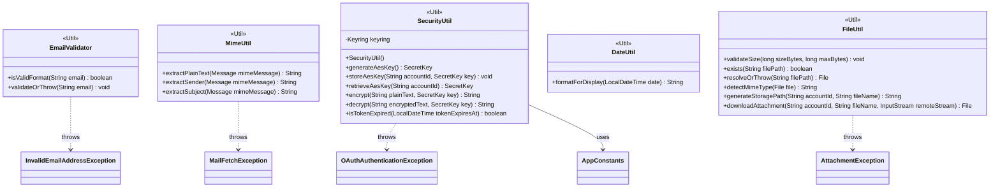

**Key syntax used here:**
- `<<Util>>`: Stereotype marking utility classes with no domain identity of their own (neither entities nor exceptions).
- `..>`: **Dependency.** The origin class uses/throws the referenced class, without containing it or inheriting from it.
- `-->`: **Association/Usage.** The origin class holds a reference to the target class.
- `-`, `+`: Access modifiers (Private, Public).

**Design notes:**

1. `EmailValidator`, `MimeUtil`, `DateUtil`, and `FileUtil` are 100% static classes (no own constructor, no state). All their methods resolve their logic purely from the parameters received.

2. `SecurityUtil` is the only class in the package that requires a constructor, because it initializes once the external dependency towards the OS-native credential store (Windows Credential Manager / macOS Keychain / Linux Secret Service, via the `java-keyring` library). That initialization is saved in the `keyring` field and reused on every call.

3. Token/content handling uses AES-256-GCM. The AES key is stored and retrieved from the OS keyring (not derived from a master password, to avoid the unnecessary computational cost of a KDF in this OAuth-based authentication flow).

4. **`SecurityUtil.encryptToken`/`decryptToken` from the original design were generalized into `encrypt`/`decrypt`**, since encryption at rest now covers not only OAuth tokens but also mail body content (`bodyPlainText`, `bodyHTML`) and attachments. Both methods now take a plain `String key`-agnostic payload plus the `SecretKey` to use, making them reusable across `MailDAO`, `DraftDAO`, and `AttachmentDAO`. `SecurityUtil` depends on `AppConstants` to read `AES_KEY_SIZE_BITS` when generating a new key via `generateAesKey()`.

5. Internally, `encrypt`/`decrypt` follow the standard practice of prepending a randomly generated 12-byte IV (Initialization Vector) to the GCM ciphertext, then Base64-encoding the combined bytes into a single `String` — this keeps every encrypted column in SQLite (`bodyPlainText`, `bodyHTML`, `accessToken`, `refreshToken`, etc.) a plain single `string` column, with no need for a separate IV column.

6. `FileUtil.downloadAttachment` follows an **on-demand download** strategy: incoming attachments are not copied locally during inbox sync, only when the user explicitly requests them. **Its signature was updated** from `downloadAttachment(int idAttachment, InputStream remoteStream)` to `downloadAttachment(String accountId, String fileName, InputStream remoteStream)`, so it can reuse `generateStoragePath(accountId, fileName)` internally instead of duplicating storage-path logic in two places — keeping a single source of truth for how attachment paths are built. The `InputStream` received as a parameter comes from the `service` package (Jakarta Mail/IMAP), keeping `FileUtil` blind to the originating protocol — it neither knows nor depends on the active IMAP session.

7. The dependencies (`..>`) towards the `exception` package reflect which checked exception each Util class throws when its validation fails, per the `uml-exception.md` diagram already defined.