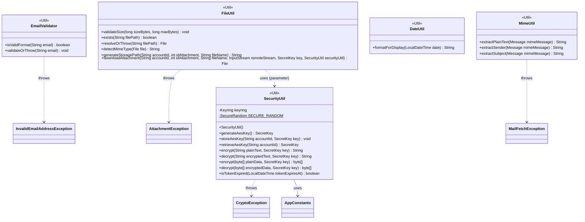

**Key syntax used here:**
- `<<Util>>`: Stereotype marking utility classes with no domain identity of their own (neither entities nor exceptions).
- `..>`: **Dependency.** The origin class uses/throws the referenced class, without containing it or inheriting from it.
- `-->`: **Association/Usage.** The origin class holds a reference to the target class.
- `-`, `+`: Access modifiers (Private, Public).
- `$`: Suffix denoting a **static** member.

**Design notes:**

1. `EmailValidator`, `MimeUtil`, `DateUtil`, and `FileUtil` are 100% static classes (no own constructor, no state). All their methods resolve their logic purely from the parameters received.

2. `SecurityUtil` is the only class in the package that requires a constructor, because it initializes once the external dependency towards the OS-native credential store (Windows Credential Manager / macOS Keychain / Linux Secret Service, via the `java-keyring` library). That initialization is saved in the `keyring` field and reused on every call.

3. Token/content handling uses AES-256-GCM. The AES key is stored and retrieved from the OS keyring (not derived from a master password, to avoid the unnecessary computational cost of a KDF in this OAuth-based authentication flow).

4. **`SecurityUtil` now exposes both `String` and `byte[]` overloads of `encrypt`/`decrypt`.** The `byte[]` overloads hold the real AES-GCM logic (IV generation, cipher init, prepend IV to ciphertext); the `String` overloads are thin wrappers that convert to/from UTF-8 bytes and Base64 around the `byte[]` versions — eliminating the duplicated cryptographic logic that existed when both were implemented independently. `String` overloads are used for tokens and mail body content (`MailDAO`, `DraftDAO`, `AccountDAO`, all via their respective Repository); the `byte[]` overloads are used exclusively by `FileUtil` for attachment content, avoiding the ~33% size overhead and extra in-memory copy that a mandatory Base64 round-trip through `String` would add for files up to 25 MB.

5. Internally, `encrypt`/`decrypt` follow the standard practice of prepending a randomly generated 12-byte IV (Initialization Vector) to the GCM ciphertext. For the `String` overloads, the combined bytes are then Base64-encoded into a single `String` — keeping every encrypted text column in SQLite (`bodyPlainText`, `bodyHTML`, `accessToken`, `refreshToken`, etc.) a plain single `string` column, with no need for a separate IV column. For the `byte[]` overloads (attachments), no Base64 step is applied — the raw IV+ciphertext bytes are written directly to disk by `FileUtil`.

6. **`SECURE_RANDOM` is a single reused `static final SecureRandom` instance**, not a new instance created on every `encrypt()` call, and specifically **not** `SecureRandom.getInstanceStrong()`. The latter can resolve to a blocking entropy source (e.g. `NativePRNGBlocking` on Linux) intended for long-lived master keys or certificates — inappropriate for generating a per-message IV, and a real risk of stalling a `Task` thread during a 50-mail inbox sync. A plain `new SecureRandom()`, reused across calls, is the standard practice for IV generation: cryptographically sound, and non-blocking.

7. **`FileUtil.downloadAttachment` follows an on-demand download strategy**: incoming attachments are not copied locally during inbox sync — the `Attachment` metadata row (`fileName`, `mimeType`, `sizeBytes`) is inserted with a `null` `filePath`, and the file itself is only fetched when the user explicitly clicks it. **Its signature takes `idAttachment`**, not just `accountId`/`fileName`, because `generateStoragePath` namespaces the on-disk path by attachment ID (`attachments/{accountId}/{idAttachment}/{fileName}`) — `idAttachment` is already known at this point (the row was inserted during sync) and is guaranteed unique (PK), unlike `fileName`, which two different mails could easily share, risking silent overwrites.

8. **`FileUtil` receives both `SecretKey` and `SecurityUtil` as method parameters**, not as constructor dependencies, to keep the class fully static. The content is encrypted in memory (`securityUtil.encrypt(rawBytes, key)`) before ever touching disk — attachments are never persisted unencrypted, matching the same at-rest standard already applied to tokens and mail bodies. `FileUtil.downloadAttachment` only writes to the filesystem; persisting the resulting path back to the `attachment` table is the caller's responsibility (see `uml-repositories.md`, note 9).

9. The dependencies (`..>`) towards the `exception` package reflect which checked exception each Util class throws when its validation fails, per the `uml-exception.md` diagram already defined. `SecurityUtil` throws `CryptoException` exclusively — see `uml-exception.md`, note 8, for why this was split from `OAuthAuthenticationException`.